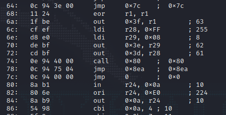
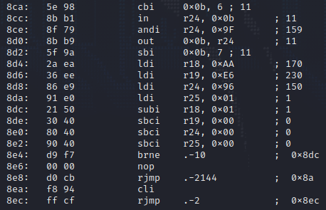
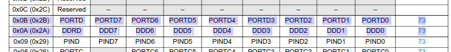
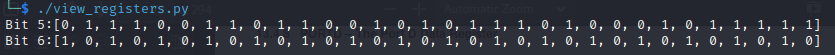

> **Challenge Description**: Concerned about the integrity of devices produced at a remote fabrication plant, management has ordered a review of our production line.
> This revealed many things, including a weird embedded device in one of our serial networks.
> In attempting to remove it, we accidentally triggered a hardware failsafe, which resulted in the device stopping working.
> However, luckily we extracted the firmware prior to doing so. We need to find out what it did to the slave device it was tapped into, can you help us?
> The microcontroller of the device appears to be an atmega328p.

## Walkthrough

We are given the file `extracted_firmware.hex` which contains the hex strings of the data.
A quick google search tells us that we can use the `avr-objdump` to get the disassembly of this binary blob.

`avr-objdump -s -m avr5 extracted_firmware.hex -D`

Looking at the disassembly, it seems that there are a lot of repeated instructions, but there are a few sections where the code is different.





We can analyze the repeated sections first to get an idea of what its repeatedly doing.

There seems to be two instructionst that repeated, `cbi` and `sbi` and they are working on the registers at `0x0A` and `0x0B`.

Looking at the datasheet we can see that these are the `DDRD` and `PORTD` registers respectively.



The `cbi` instruction clears a bit in the register, and `sbi` sets the bit.
Reading about the pin configuration reveals more information as well.

> The DDxn bit in the DDRx register selects the direction of this pin.
> If DDxn is written logic one, Pxn is configured as an output pin.
> If DDxn is written logic zero, Pxn is configured as an input pin.

Thus based on this, we know that the instruction at address `0x86` is writing logic zero to `DDD4`, meaning that `PIND4` is configured as an input pin.
However, this isn't as interesting as the data being written to the `PORTD` data register, which presumably holds the data to be sent as output.
The instructions:
```
54 98           cbi     0x0a, 4 ; 10
5f 9a           sbi     0x0b, 7 ; 11
5f 98           cbi     0x0b, 7 ; 11
```
seems to clear the USART internal clock, then seems to toggle bit 7 of Port D, which can either be the analog comparator negative input, or the pin change interrupt source 23.
I wrote a python script to visualize the changes in the register bits for the rest of the instructions, which helped me see that Port D6 was changing in a repeated pattern, while Port D5 was not changing in a discernable pattern.



Bit 6 seems to be alternating between 0 and 1 so I don't think it would have anything interesting to show.
Since bit 5 looks more random, I decided to try figure out what it creates.
Since this is probably transmitting over UART or some type of serial interface, I figured I should start there for visualizing it.

In the end, this was my solution for pulling getting the flag.
For the script to work, you need to isolate the big chunk of `cbi` and `sbi` instructions and ignore the others.
```Python3
#!/usr/bin/python3

def main():
    bit_5 = []
    bit_6 = []
    lines = None
    with open("disassembly.txt") as f:
        lines = f.readlines()
    for instr in lines:
        op, reg, bit = process_instr(instr)
        if op == "cbi":
            if bit == 5:
                bit_5.append(0)
            elif bit == 6:
                bit_6.append(0)
        elif op == "sbi":
            if bit == 5:
                bit_5.append(1)
            elif bit == 6:
                bit_6.append(1)
    ctr = 0
    b_string = ""
    characters = ""
    for b in bit_5:
        b_string += str(b)
        ctr += 1
        if ctr == 8:
            characters += chr( int(b_string, 2) )
            b_string = ""
            ctr = 0
    print(characters)

def process_instr(instr):
    values = instr.strip().split("\t")
    op = values[0]
    operands = values[1].split(", ")
    return (op, operands[0], int(operands[1]))

def cbi_1(register, bit):
    register.append(0)

def sbi_1(register, bit):
    register.append(1)

main()
```

The flag is: `HTB{817_84n91n9_15_3v32ywh323!@#$%}`