> **Challenge Description**: After more and more recent hits of the infamous Jupiter Banking Malware we finally managed to get a sample of one module.
> Supposedly it steals secrets from Firefox users?

## Initial Analysis

`PEBear` show little to no imports so I can assume that the import table is being obfuscated or functions are being dynamically imported at runtime.
Also, based on the challenge description I think I can probably find the flag once I figure out exactly what it is doing with FireFox, or what secrets it is stealing.

## IDA

The `main` function is pretty straightforward.
A payload is decrypted via single byte XOR decryption routine, then the payload is injected into a remote thread in the Firefox process.

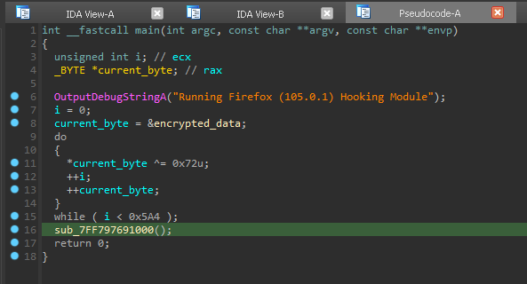 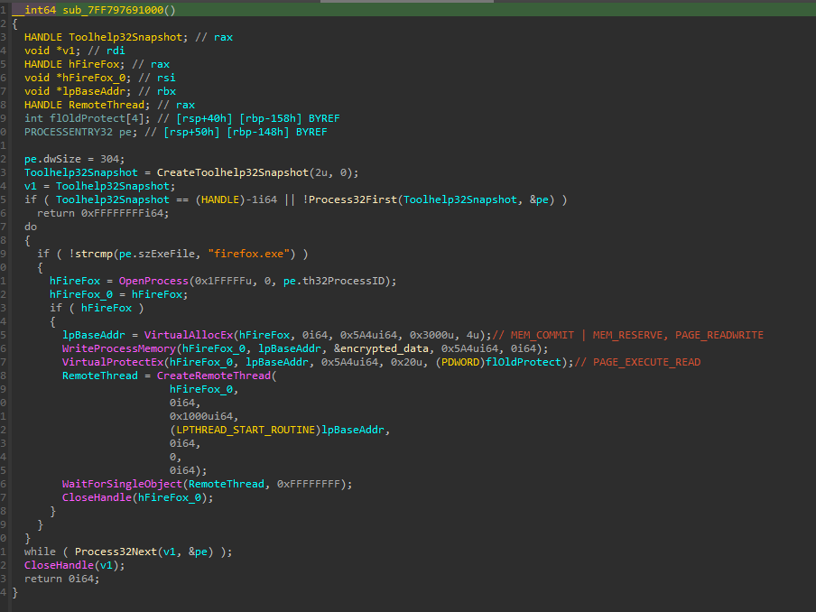

Since the decryption is so simple, I just ran through the decryption, then patched the executable using `HxD` to contain the original payload.

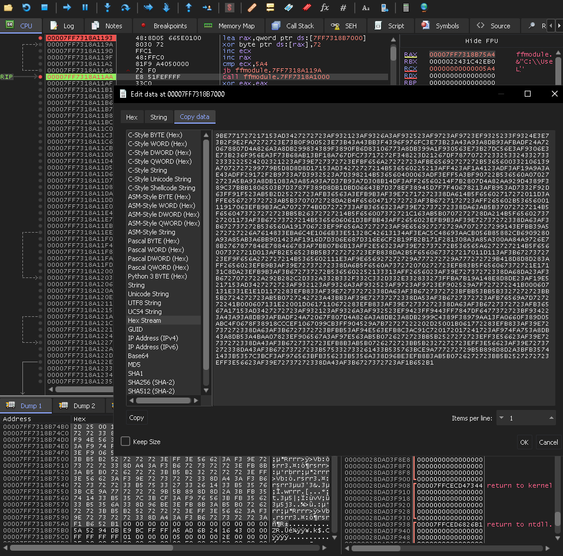

Now we can view the decrypted payload in IDA.
The first line of code seems to get a pointer to some loaded DLL, then search through its function names until it finds the one that has the inverted CRC checksum of `0x43AAC47D` which uninverted is `0xBC553B82`.
This is definitely some form of dynamic API importing.

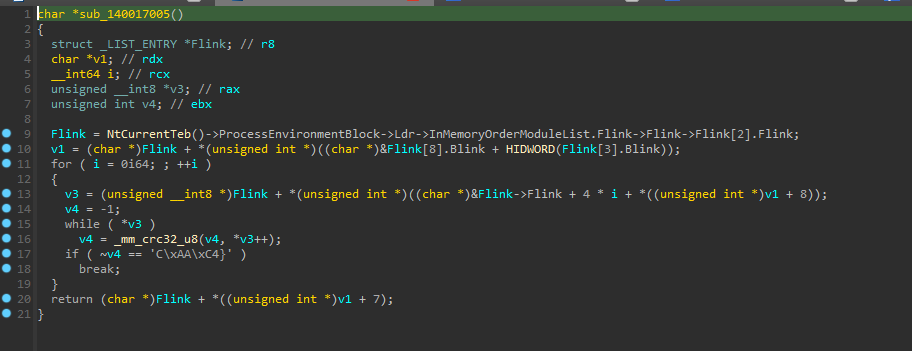

`NtCurrentTeb()` will return a pointer to a `TEB` structure.
```c
typedef struct _TEB {
    PVOID Reserved1[12];
    PPEB  ProcessEnvironmentBlock;
    PVOID Reserved2[399];
    BYTE  Reserved3[1952];
    PVOID TlsSlots[64];
    BYTE  Reserved4[8];
    PVOID Reserved5[26];
    PVOID ReservedForOle;
    PVOID Reserved6[4];
    PVOID TlsExpansionSlots;
} TEB, *PTEB;
```
This structure is then used to access the Process Environment Block, which as you can guess contains process information.

```c
typedef struct _PEB {
    BYTE                            Reserved1[2];
    BYTE                            BeingDebugged;
    BYTE                            Reserved2[1];
    PVOID                           Reserved3[2];
    PPEB_LDR_DATA                   Ldr;
    PRTL_USER_PROCESS_PARAMETERS    ProcessParameters;
    PVOID                           Reserved4[3];
    PVOID                           AtlThunkSListPtr;
    PVOID                           Reserved5;
    ULONG                           Reserved6;
    PVOID                           Reserved7;
    ULONG                           Reserved8;
    ULONG                           AtlThunkSListPtr32;
    PVOID                           Reserved9[45];
    BYTE                            Reserved10[96];
    PPS_POST_PROCESS_INIT_ROUTINE   PostProcessInitRoutine;
    BYTE                            Reserved11[128];
    PVOID                           Reserved12[1];
    ULONG                           SessionId;
} PEB, *PPEB;
```

Then the `Ldr` structure is grabbed which contains information about the loaded modules:

```c
typedef struct _PEB_LDR_DATA {
    BYTE        Reserved1[8];
    PVOID       Reserved2[3];
    LIST_ENTRY  InMemoryOrderModuleList;
} PEB_LDR_DATA, *PPEB_LDR_DATA;
```
The `InMemoryOrderModuleList` is just a doubly linked list of the modules that are loaded into the process.
So this code is parsing through the loaded modules until it finds the one it wants, which it assumes will always be at the same location.
What module is this?
In order to find out, we have to use `x64dbg` to run through this process until it write the payload over the Firefox process memory space, attach to the firefox process, and run the code until we find the module it wants.

## Remote Thread

So I boot up `x64dbg`, set breakpoints at `OpenProcess`, `VirtualAllocEx`, and `VirtualProtectEx`.
The reason I don't break at `CreateRemoteThread` is because I will create the thread myself.
Why would I do that?
I was having trouble with attaching to the thread that `ffmodule` creates, and just found it was easier this way.
Just make sure you note down the handle you get from `OpenProcess` and the address that `VirtualAllocEx` gives you so you attach to the correct process and then are able to set a break point at the correct spot (which in my case was `0x00000182CC7F0000`).

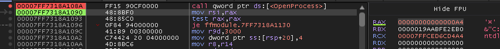 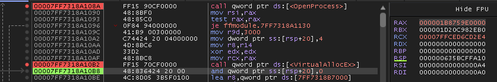

Then we continue until the instruction right after `VirtualProtectEx` since at this point the payload is written, and can be executed in the remote process.

Now we just head over to the `Handles` tab to find the `PID` for our handle, and attach to the process.
Then head over to the address we got from `VirtualAllocEx`.
We know we got the right address because the instructions here will match the instructions from the decrypted payload in ghidra.

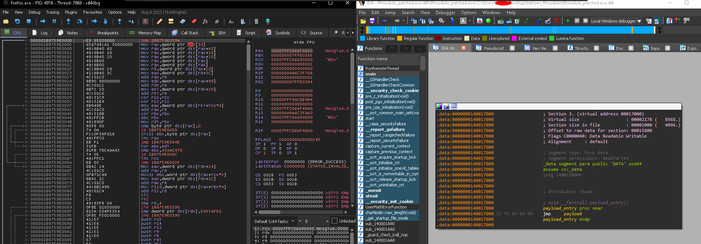

Now we can create the thread manually with the `createthread <payload_addr>` command, and switch to it with the `switchthread <thread_id>` command.
You won't see the thread right away, first you need to run until return.
Then the thread should show up in your `Threads` tab.
Then we can continue until we are at the start of our payload.
Now I set breakpoints at the `crc` instruction so I can what function name its comparing as well as when it breaks.
When it breaks it will tell us the function it has imported.

However, I'd rather just know right away so I rebuilt the functionality in lil cpp tool.
```cpp
// g++ -o api api.cpp -msse4.2

#include <immintrin.h>
#include <iostream>
#include <cstring>

unsigned int custom_crc32_u8(const char* data, size_t length, unsigned int crc) {
    for (size_t i = 0; i < length; i++) {
        crc = _mm_crc32_u8(crc, data[i]);
    }
    return crc;
}


int main() {
    const char* names[] = { 
        "functionNames",
    };
    unsigned int initial_value = 0xFFFFFFFF;

    for (const char* name : names) {
        unsigned int crc = custom_crc(name, strlen(name), initial_value);
        if ( ~crc == 0x43AAC47D) {
            std::cout << "~CRC-32 for '" << name << "': 0x" << std::hex << crc << std::dec << std::endl;
            break;
        }
    }
    return 0;
}

```
I was able to get the function names from this [page](https://www.geoffchappell.com/studies/windows/win32/kernel32/api/) with the following python script:
```py
import requests
from bs4 import BeautifulSoup

URL = "https://www.geoffchappell.com/studies/windows/win32/kernel32/api/"

resp = requests.get(URL)
h = resp.text
soup = BeautifulSoup(h, 'html.parser')
fns = [tag.text for tag in soup.find_all('span', class_='function')]
print(fns)
``` 

Now we can see that it wants `GetProcAddress`.
It then goes on to resolve `VirtualAlloc`

It should be noted that these addresses are being stored in `R12` and `R15` respectively.

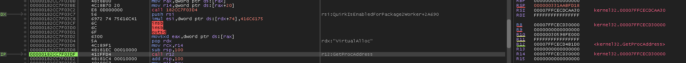

We can follow the returned address in dump to monitor any changes to this region.
Then it resolves `VirtualProtect` but stores that one on the stack.
Then its time for another api hashing sesh, but this time against the loaded modules.
Specifically, it wants 3 more modules:
```
8861D80B
3DCE28A2
83BCBE6A
```
We can export a list of the loaded modules from x64Dbg and parse them with python, and then run them through our hashing cpp code.
Using this method I see that `0x3DCE28A2` corresponds to `NSS3.dll`, and `0x8861d80b` is for the lowercase version.
I'm guessing the third hash is just a fake to try and dupe the analyst.
After it gets the base address of this module, it gets the address for `PR_Write`.
Firefox docs have the following for this call:
```c
PRInt32 PR_Write(
  PRFileDesc *fd,
  const void *buf,
  PRInt32 amount);
```
After getting the address for this function, it is placed in `R15`, overwriting the pointer to `VirtualAlloc`.
Then the code from `PR_Write` is copied into the allocated memory from before.
Seems like a copy is being made, probably for a hook.
Later, the code from `PR_Write` is saved to the previously allocated buffer.
There is check to stop when it finds certain instructions contained in `RBX` but it never finds them , leading it to write to out of bounds so I just manually made it pass the check.
Then it changes permissions on the copied instructions to `PAGE_EXECUTE_READ`.
Then the memory at the real `PR_Write` has its permissions changed to `PAGE_EXECUTE_READWRITE`.


Then the start of `PR_Write` is overwritten with the bytes: `4155415449BC` which corresponds to the instructions.
A comparison of the before and after is shown here:

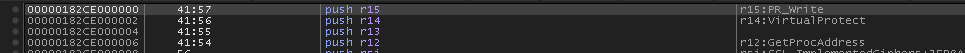 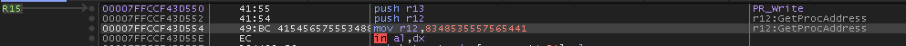

The final hooked function looks like this:

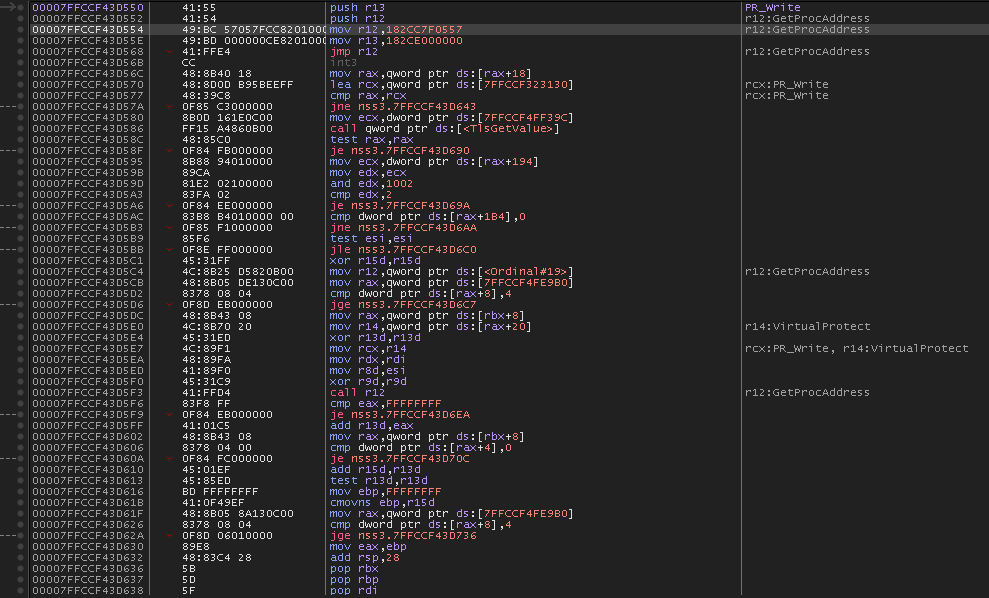

If we follow the hook, we end up at a function that has a check for `RBX` being less than or equal to 4.
On a matching condition, the hook exits, so I nopped it.
Then it checks if the value pointed at by `RDX` is equal to the command `STOP`.
If its not equal it will also exit.
So we jump over that and continue.
I also have intuition to continue here because I see another hashing loop later on down this path, so I'm curious to see what comes out of it.
It turns out to be wanting `WS_32.dll`.

## Endgame

So I forgot to take screenshots when I solved it, and I don't feel like going through the challenge again to get them, so I'll just summarize what ended up happening.
I set a breakpoint at the `PR_Write` function, and waiting until it was hit with data.
Once the data was hit, the data gets encrypted.
The encryption depends on a key generated from bytes right before the encryption routine, and the amount of bytes read from that area depend on the size of the data being encrypted.
Regardless of the size, the first 32 bytes of the key will always be the flag.
The key generation and encryption takes a minnnn to complete if you are stepping through with breakpoints, we can modify the call to `PR_Write` `size` parameter to 32, which will make the flag appear one byte at a time before they are used to encrypt the data.