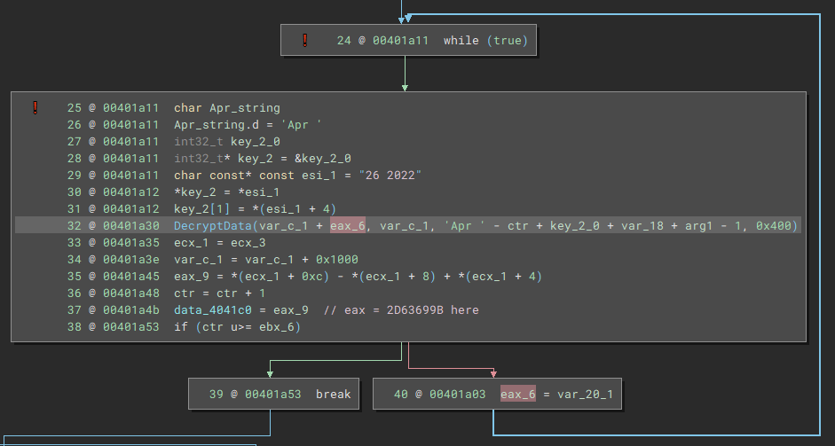
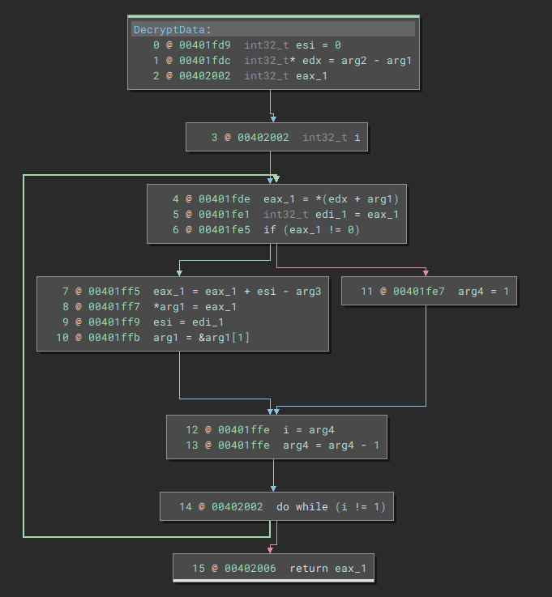

## Sample Info

[0a66e8376fc6d9283e500c6e774dc0a109656fd457a0ce7dbf40419bc8d50936](https://bazaar.abuse.ch/sample/0a66e8376fc6d9283e500c6e774dc0a109656fd457a0ce7dbf40419bc8d50936/)

## Unpacking

The `dll` is loaded at `0x400000` in `x32dbg`.
We can set breakpoints at `VirtualAlloc` and `VirtualProtect` to catch any regions of memory where the desired payload will be unpacked to.
This method will show that `VirtualAlloc` is called 3 times.
The first contains some encrypted or encoded data, and isn't very useful to us.
The second call will allocate at `x0dF0000` where a mangled `PE` gets written to.
The third call is interesting because it comes from the PE file written to the second allocation.

This third allocation is made at `0x2BC0000` and also contains a `PE` file, but its headers are not mangled like the first.
We can dump this one to take a look.
Alternatively, you can also go through the `VirtualProtect` calls.
This `PE` will be used to overwrite the running process.
After the last `VirtualProtect`, you can dump the original process memory and you'll have the same bin file.

 

## Reversing Encryption Routine

At this point, I wasn't sure if this was the last stage or not, so I continue in `x32dbg` in case I ran into more `VirtualAlloc` or `HeapAlloc` but pretty soon realized this was the main module.
The sample will use local APC injection to run some threads to decrypt the config we want and a few other tasks.
For the sake of brevity I will skip pass that process, but if you wanted to repeat it, you could set a break point at `CreateThread`, and once you get there, change the `EIP` to point to the thread payload, which should be `0x401b7f`.
After locating the code that was decrypting the config data in `.bss`, I was able to continue the reversing process in Binary Ninja.

 

The decryption process is pretty straightforward from here.
A key is generated using `Apr ` and `26 2`, the virtual address of the `.bss` section, and some other values that are used for bruteforcing.
This data is passed into the subcall that performs the actual decryption routine.

