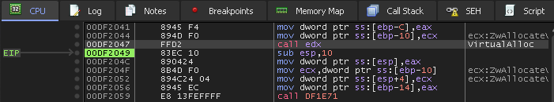
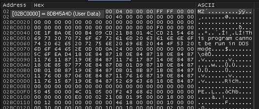
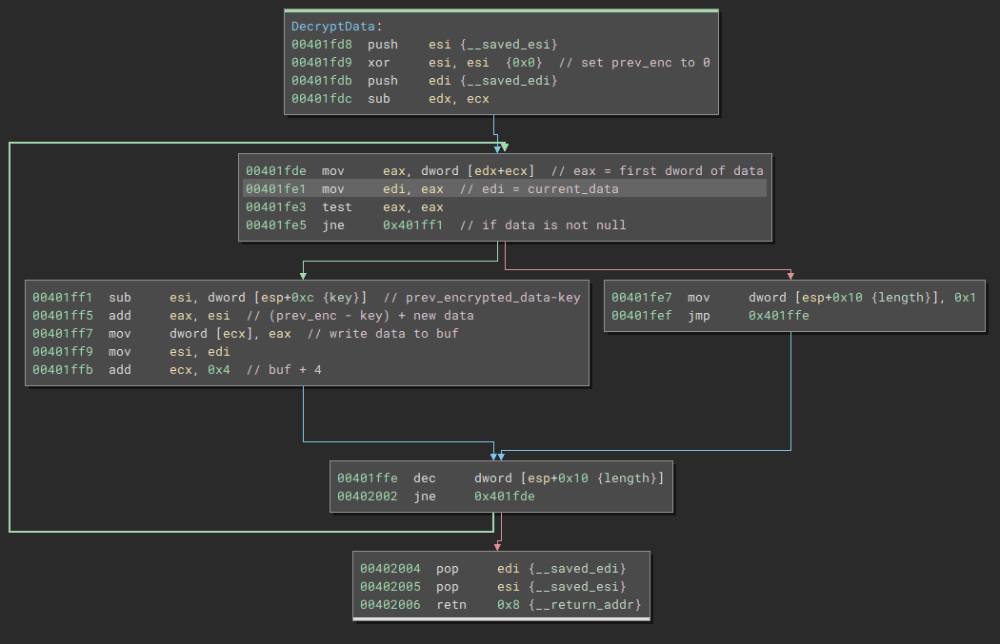
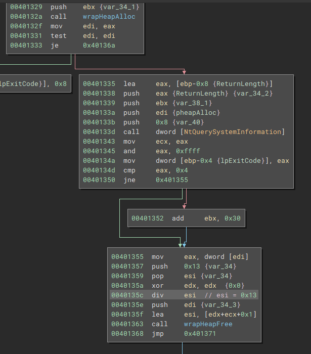

## Sample Info

[0a66e8376fc6d9283e500c6e774dc0a109656fd457a0ce7dbf40419bc8d50936](https://bazaar.abuse.ch/sample/0a66e8376fc6d9283e500c6e774dc0a109656fd457a0ce7dbf40419bc8d50936/)

## Unpacking

The `dll` is loaded at `0x400000` in `x32dbg`.
We can set breakpoints at `VirtualAlloc` and `VirtualProtect` to catch any regions of memory where the desired payload will be unpacked to.
This method will show that `VirtualAlloc` is called 3 times.
The first contains some encrypted or encoded data, and isn't very useful to us.
The second call will allocate at `x0dF0000` where a mangled `PE` gets written to.
The third call is interesting because it comes from the PE file written to the second allocation.



This third allocation is made at `0x2BC0000` and also contains a `PE` file, but its headers are not mangled like the first.
We can dump this one to take a look.
Alternatively, you can also go through the `VirtualProtect` calls.
This `PE` will be used to overwrite the running process.
After the last `VirtualProtect`, you can dump the original process memory and you'll have the same bin file.

 

At this point, I wasn't sure if this was the last stage or not, so I continue in `x32dbg` in case I ran into more `VirtualAlloc` or `HeapAlloc` but pretty soon realized this was the main module.
The sample will use local APC injection to run some threads to decrypt the config we want and a few other tasks.
For the sake of brevity I will skip pass that process, but if you wanted to repeat it, you could set a break point at the call to `CreateThread` (`0x402020`), and once you get there, change the `EIP` to point to the thread payload, which should be `0x401b7f`.
After locating the code that was decrypting the config data in `.bss`, I was able to continue the reversing process in Binary Ninja.

## Reversing Decryption Routine

The decryption process is pretty straightforward from here.
First, a base of 0 is established.
Then the key is subtracted from this base.
Then this new value (`base - key`) is added with the `dword` of data being decrypted.
Then the decrypted data is written to a buffer.
This loop will happen a max of `0x400` times, or until the data grabbed is 0.



The pseudo code could be understood as:


```python
result = ""

prev = 0
for i in range(400):
    dword = encrypted_data[ i*4 : (i*4) + 4 ]
    if dword == 0x0:
        break
    x = prev - key
    decrypted_dword = x + dword
    result += decrypted_dword
```

## Key generation

Figuring out the key is a bit more tricky.
Stepping through `x32dbg` I was able to figure out the formula to be:
```
key = 'Apr ' + '26 2' + <.bss rva> + some int - 1
```
Some int is a value picked up from calling `NtQuerySystemInformation` and grabbing a `dword` from it.
The value itself doesn't matter, because that value is divided by `0x13`, and then two values, the `NTSTATUS` return value and 1, are added to it.
`STATUS_SUCCESS` is defined as `0x0`, so as long as `NtQuerySystemInformation` succeeds, we are only really adding 1 to our remainder.
Hence the possible values of this mystery integer are 1 - 0x14.



## Final Script

Through a little brute force, you can figure out that the secret value is supposed to be 18.
Here's the final script I used, its meant to be ran with `Binja`.

```python
from binaryninja import BinaryReader

def decrypt_strings(secret_sauce):
    bss = bv.get_section_by_name(".bss").start
    br = BinaryReader(bv, address=bss)

    rva = bss - 0x400000
    key1 = int.from_bytes(b"Apr ", "little")
    key2 = int.from_bytes(b"26 2", "little")
    key = key1 + key2 + rva + secret_sauce

    prev = 0x0
    curr = int.from_bytes(br.read(0x4), "little")
    data = b""
    for _ in range(400):
        if curr == 0x0:
            break
        result = (prev - key + curr & 0xffffffff).to_bytes(4, "little")
        data += result
        prev = curr
        curr = int.from_bytes(br.read(0x4), "little")
    return data

print(decrypt_strings(18))
```