## Sample Info

[0581f0bf260a11a5662d58b99a82ec756c9365613833bce8f102ec1235a7d4f7](https://bazaar.abuse.ch/sample/0581f0bf260a11a5662d58b99a82ec756c9365613833bce8f102ec1235a7d4f7/)

## Initial Analysis

Based on the few number of imports, and the size of the `.data` section, this sample is likely packed.

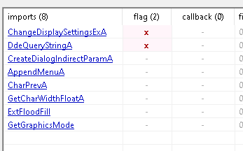 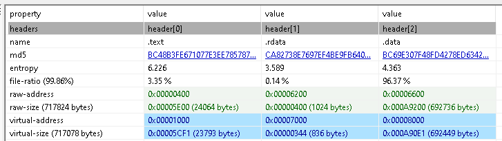 

## Unpacking

Unpacking proved to be more difficult than expected.
None of my breakpoints every got reached because my debugger exited before ever reaching the sample's entry point.
Additionally, after `x64dbg`'s call to `LoadLibraryW` to load the sample, I could see that the sample had some memory reserved, but none of it's sections were mapped.
I figured it was probably receiving the wrong reason from the calling process and this was an anti analysis feature.
But then after looking at `PE-Bear` a lil more I realized that this `DLL` has a number of exports, so I could just use `rundll.exe` to call the functions manually and pass this obstacle.

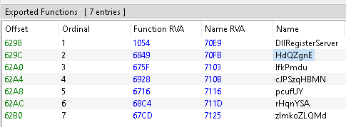

After the dll is loaded in `x64dbg`, I just set breakpoints on each of the exported functions.

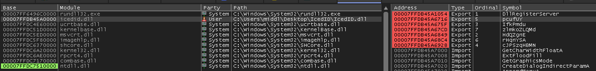

When continuing, the first breakpoints I hit is the first function I called, `DllRegisterServer`.
This function was filled with instructions like `cmp al, al; jne` which were interesting because I don't think the jump would ever trigger.
My thought is that this was supposed to be an anti analysis technique.
Also, I quickly realized that debugging without knowing what I was looking for would be confusing and not very fruitful so I went back to binja to do some static analysis.
However, due to the fake branching, the code is a bit convuluted and hard to follow.
I decided to make a script to get rid of them.

```python
def is_fake_cmp(instr):
    if instr.tokens[0].text == "cmp":
        op1 = instr.tokens[2]
        op2 = instr.tokens[4]
        if op1.text == op2.text:
            return True

def is_jump(instr):
    if instr.tokens[0].text in ["je", "jne", "jz", "jnz"]:
        return True
    else:
        return False

def find_fake_jmps(basic_block):
    fake_jmps = []
    instructions = basic_block.get_disassembly_text()
    ctr = 0
    while ctr < len(instructions):
        instr = instructions[ctr]
        if is_fake_cmp(instr):
            #print(f"[i] Fake cmp @ 0x{instr.address:016X}")
            next_instr = instructions[ctr + 1]
            if is_jump(next_instr):
                print(f"[*] FOUND FAKE jump @ 0x{next_instr.address:016X}")
                fake_jmps.append( (instr, next_instr) )
                ctr += 1
        ctr += 1
    return fake_jmps

def patch_fake_jmp(instr_pair):
    cmp_instr = instr_pair[0]
    jmp_instr = instr_pair[1]
    jmp_type = jmp_instr.tokens[0].text

    if jmp_type == "je":
        bv.always_branch(jmp_instr.address)
    elif jmp_type == "jne":
        bv.never_branch(jmp_instr.address)
    elif jmp_type == "jz":
        bv.always_branch(jmp_instr.address)
    elif jmp_type == "jnz":
        bv.never_branch(jmp_instr)
    else:
        print(f"[!] Unhandled jmp @ 0x{jmp_instr.address:016X}")
        return False
    bv.convert_to_nop(cmp_instr.address)
    return True

def remove_fake_branches(fn_addr):
    n_patched = 0
    f = bv.get_function_at(fn_addr)
    for basic_block in f.basic_blocks:
        fake_jmps = find_fake_jmps(basic_block)
        for fj in fake_jmps:
            if patch_fake_jmp(fj):
                n_patched +=1

bv.begin_undo_actions()
remove_fake_branches(0x7ffd00e31000)
bv.commit_undo_actions()
```
Also, from reading this [article](https://binary.ninja/2023/11/13/obfuscation-flare-on.html) you will need to disable `Tail Call Analysis` in whatever tool you are using, otherwise, the psuedo c view will not be as concise as it could be.
And just like that, the control flow becomes so much easier to read.
Ngl, seeing this happen in real time was very satisfying.

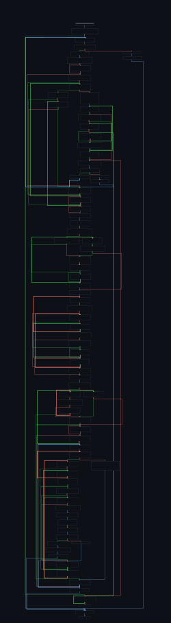 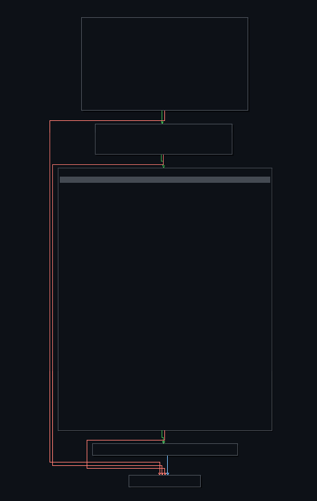

If we follow the function calls in this now super flattened function, we end up at what looks to be a function that does some api hashing, and uses stack strings.
I set breakpoints at these calls so I could figure out what api it was grabbing. 

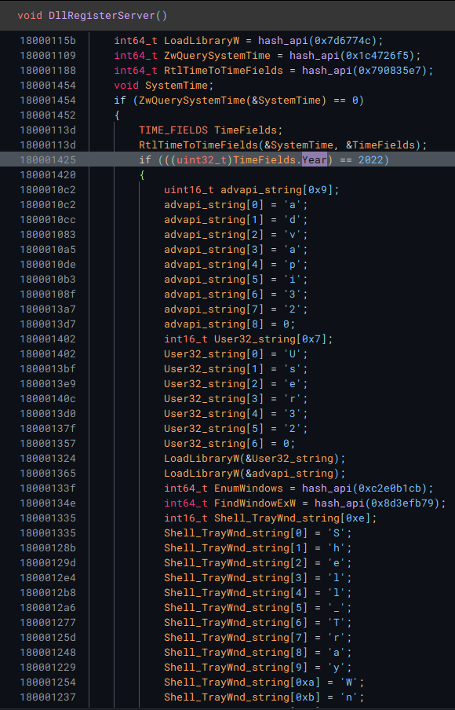 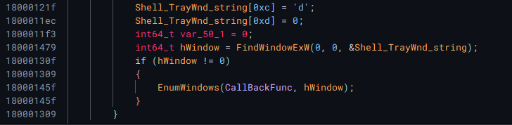

I also found a check where the malware will only run its attack if the year is `2022`.
I ended up patching this instruction to always jump in `x64dbg`.
`EnumWindows` accepts a callback function, which is a prime candidate for inserting a malicous function, so I decided to explore that next.

### Callback function

Again, this function has a lot of fake branches, so prune those first.
The callback function seems to just get a handle to a windows, then it enters a function that seems to be doing some type of memory copying operations.

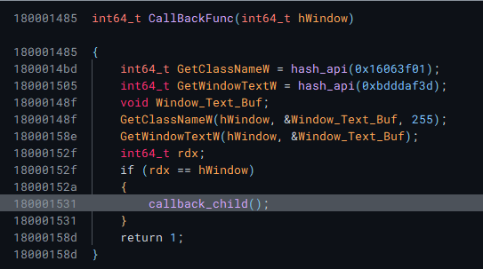 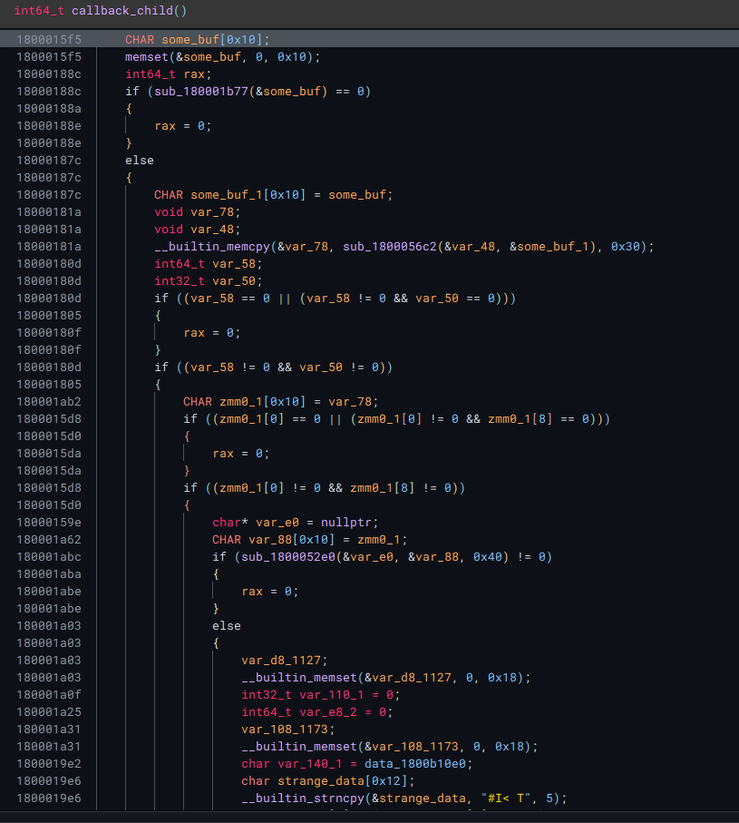

Following along some of the function calls results in finding what seems to be a promising function.
It seems to create a string `|SPL|`
Doing some OSINT reveals that this might be an IoC for `SplPacker`.

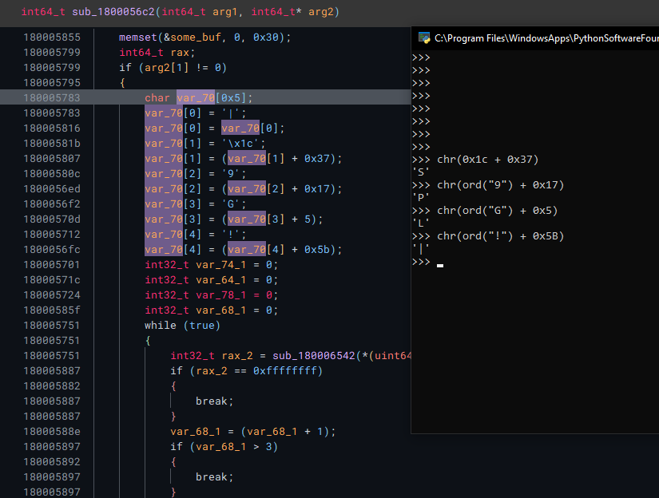

There is also a string `DllRegisterServer` that is created dynamically, so thats something else to watch out for.
Since it seems that this is modifying memory and potentially unpacking something, I figured it might be easier at this point to just reverse this part dynamically.
Also, Binja isn't correctly deducing the function calls to these resolved APIs, so we need to define them ourselves and then change their type.
We can do this by creating new types:

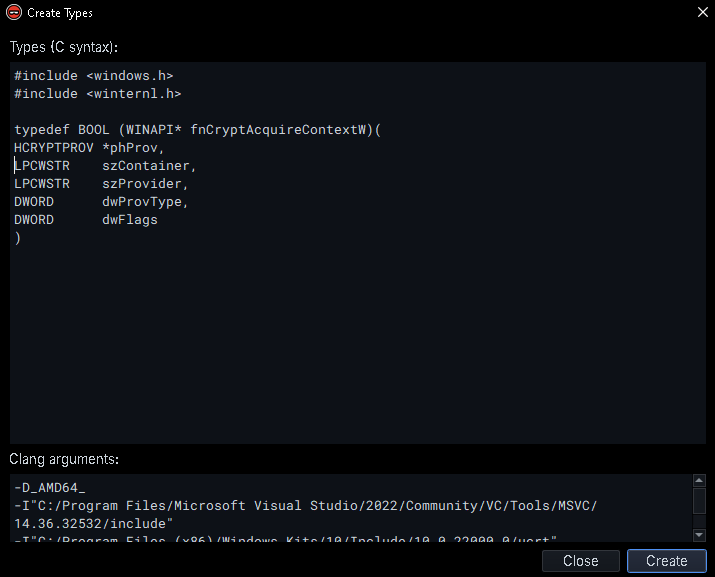

I quickly arrive at a function that is doing some type of hashing.
It doesn't specify what type of hashing to do, so the process will use the default value, which I am unsure of what it would be.
ChatGPT says this would be using `PROV_RSA_FULL`.

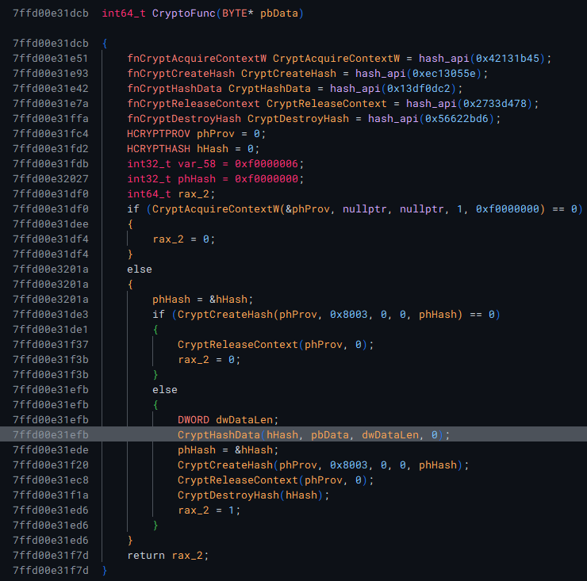

When stepping through `x64dbg`, I saw it was using `ALG_ID` of `8003` which corresponds to md5.
Also, I am able to obtain a few more hashes:

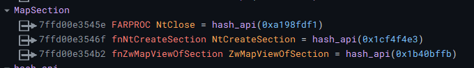

Also, as I stepped through some of the functions I found what looked to be RC4 encryption algo.
This assumption was based on the fact that it had 3 loops, each with 256 iterations, which matches up with the profile of RC4.

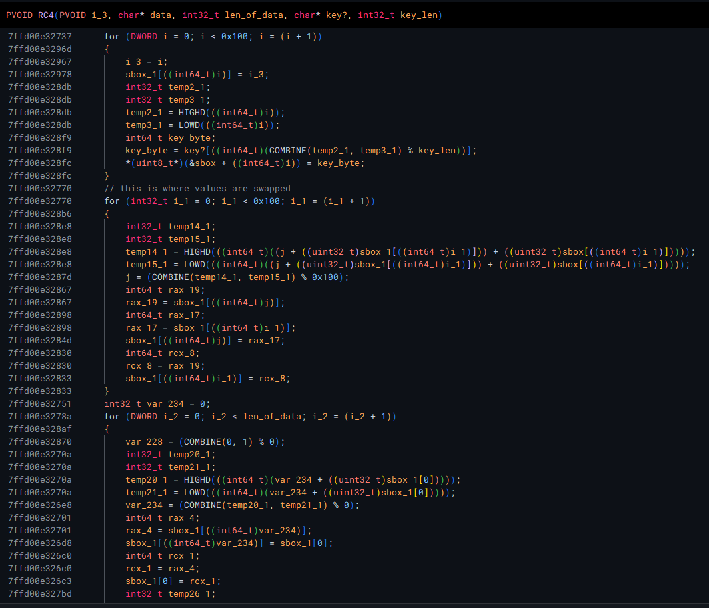

### Decryption

There are 2 references to this RC4 function, so I labeled them as potential decryption functions.
In both of these references, a key of `0x11c742c6` is used.
There is also another function that does some type of encryption or encoding using the same data, key, and key length, although I wasn't able to understand it at the time.
Additionally, from the references to the data and key, I was able to deduce that the code is using this structure:

```c
struct data_block {
    PVOID pdata;
    uint64_t data_len;
}
```
It passes references to this structure to its encryption routines.

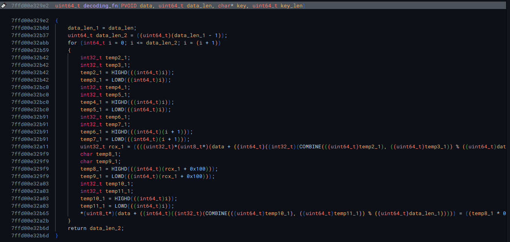

At this point, I felt that it would be easier to see how these functions are used from `x64dbg`, so I went back to it.
I ended up putting an access breakpoint on the data section, so i could see when the hex strings start getting used.
Through this method I was able to figure out the following chunk of data was some type of metadata about the hexstream in the `.data` section.

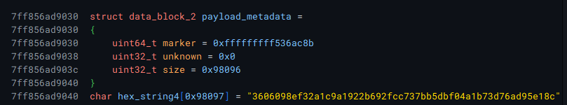

Also, the hex stream is converted from hex to bytes, and then copies into the section created by `NtCreateSection` earlier in the process.
Then the data is hashed several times, maybe to verify its integerity.
It was also at this point where I realized that the function that I had thought to be encoding was actually a second type of decryption that is applied to the data after it has been passed through the RC4 routine.
The strategy I used to do this was to check for instructions that moved data from either a stack variable or process memory to a register or vice versa.
Another hint was that this also used the same parameters as the RC4 function.
Then you see the operations that are done upon it.
The authors of this malware use an obfuscation technique in this encryption where they add values, and then subtract them, essentially restoring the original value.
The obfuscated formula for the xor encryption is:
```
data[i] = (data[i] ^ key[i % len(key)])
data[i] -= data[i + 1]
data[i] += 0x100 - 0x100
data[i] += (i % len(key)) & 0xFF
data[i] -= (i % len(key)) & 0xFF 
```
which simplifies down to:
```
data[i] = (data[i] ^ key[i % len(key)]) - data[i + 1]
```
Because python treats the operands of these operations as signed integers we also need to add a mask of `0xFF` to cut the resulting byte/s to the right size. 

We can copy these unpacking process in binary ninja with the following script:

```python
from binaryninja import Transform, BinaryReader

ADDR_OF_DATA = 0x7fff7a1a9040
KEY = 0x11c742c6
FILENAME = ""

def get_data(hexstream_addr):
    br = BinaryReader(bv, address=hexstream_addr)
    data = ""
    curr = br.read(2)
    while curr != b"\x00\x00":
        data += curr.decode("utf-8")
        curr = br.read(2)
    data = bytes.fromhex(data)
    return data

def rc4_decrypt(data, key=KEY):
    key = key.to_bytes(4, byteorder="little")
    rc4 = Transform["RC4"]
    return rc4.encode(data, {"key": key})

def xor_decrypt(data, key=KEY):
    data = bytearray(data)
    key = key.to_bytes(4, byteorder="little")
    for i in range(len(data) - 1):
        b = data[i] ^ key[i % len(key)]
        b -= data[i + 1]
        b &= b & 0xFF
        data[i] = b
    return data

def unpack(hexstream_addr):
    data = get_data(hexstream_addr)
    data = rc4_decrypt(data)
    data = xor_decrypt(data)
    with open(FILENAME, "wb") as f:
        f.write(data)
    return True

unpack(ADDR_OF_DATA)
```

This script leaves us with a big ole dump file.
But it is progress :)

If we go back to binja with all the new information we picked up from dynamic analysis, and and follow what happens after this decryption function is called, we will see that the unpacked data is parsed for the string "|SPL|".


If we search for this value ourselves, we can see that it is used as a seperator.
There are 5 payloads that are in this dump.

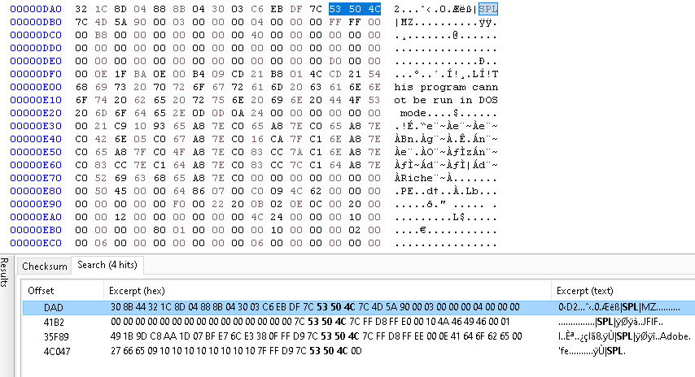

I placed each in `HxD` and used their magic bytes to determine what they are.
The first is some stub code that was jumped to from the main process.
I saw this in `x64dbg` when tracking the `NtCreateSection` api call.
The second one might be a compressed PE file, cuz I can see a PE header, but I'll analyze that in Binja soon.
The third is a full PE file.
Windows defender was able to recognize it as malware, so this is probably the payload the contains the config we want.
Section 4 was a `.jfif` file, that contain an image of a lion emblem.
I'll do some analysis on that in a bit in case it contains anything interesting inside the image.
Section 5 was a jpeg of a drawing of a woman.


## Dumped PE

This PE is a lot easier to read.
It will immediately create a thread, with `THREAD_CREATE_RUN_IMMEDIATELY`.
There is a call to `Sleep` which we can get rid of to speed up analysis.
Then we almost immediately hit the decryption routine that reveals the C2 address we have been hunting for.

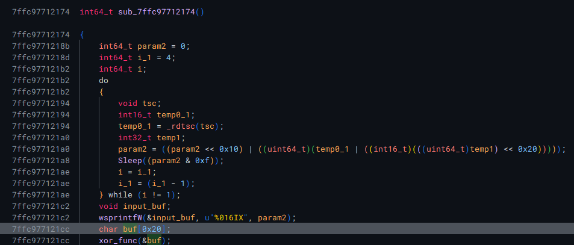 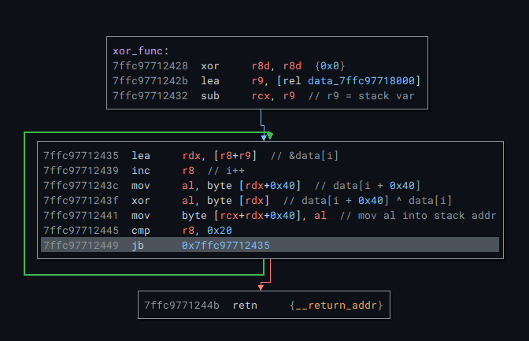

In this case it was: `ilekvoyn.com`.
Continuing through the code, it becomes clear that it is crafting a URL request to this address.
It uses a cookie value obtained early from querying something in our kernel.
Then adds in the result of `GetSysCount64` / 1000, then adds in some other values.
Since this is a quick challenge, and an old sample I did not bother seeing what how the value was being generated, but I can assume safely assume it's likely something unique to our infection.

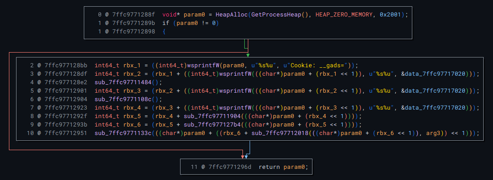 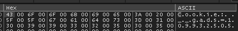

Anyways, the goal of this challenge was to unpack and grab the c2 address, and we have enough information to do that.
We just need to combine our unpacking script with the string decryption, and we should be good.

```python
from binaryninja import BinaryReader
import re

def xor_decrypt(data_addr):
    br = BinaryReader(bv, address=data_addr)
    data = br.read(0x80)
    config = b""
    for i in range(0x20):
        config += (data[i] ^ data[i + 0x40]).to_bytes(1, "little")
    return config

def extract_url_from_bytes(byte_string):
    extracted_ascii = b""
    for byte in byte_string:
        if 32 <= byte <= 126:
            extracted_ascii += bytes([byte])
    extracted_ascii = extracted_ascii.decode("utf-8")
    pattern = re.compile('.*com')
    url = pattern.search(extracted_ascii)
    return url.group(0)
    
config = xor_decrypt(0x7ffc97718000)
url = extract_url_from_bytes(config)
print(f"[*] C2 Address -> {url}")
```
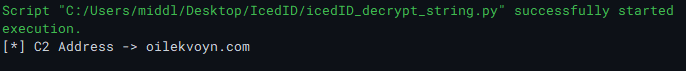

I could have automated the entirety of this, but its an old sample so I don't wanna put a ton of effort into something that may only be valid for this sample, so instead I'll move onto a fresh upload, maybe agent tesla :D

You can find all the scripts I used [HERE](https://github.com/Kvn11/scripts/tree/main)
