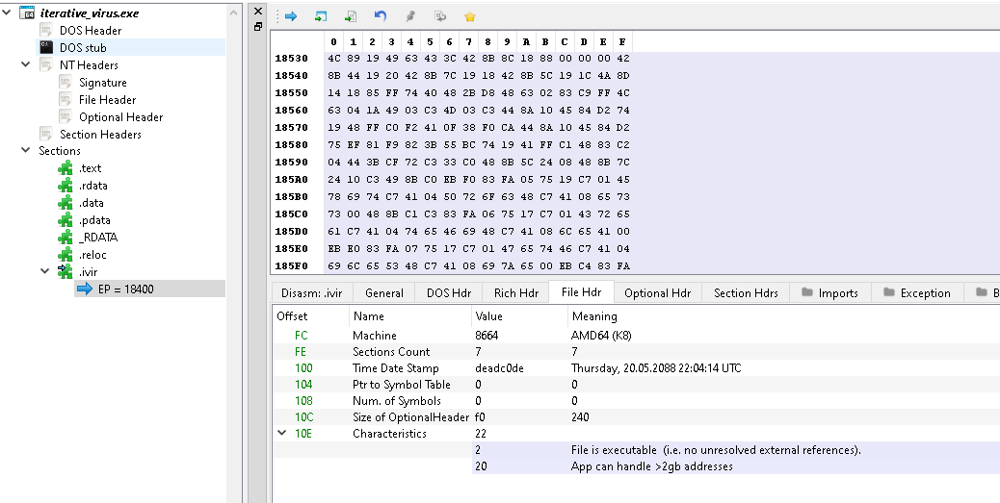
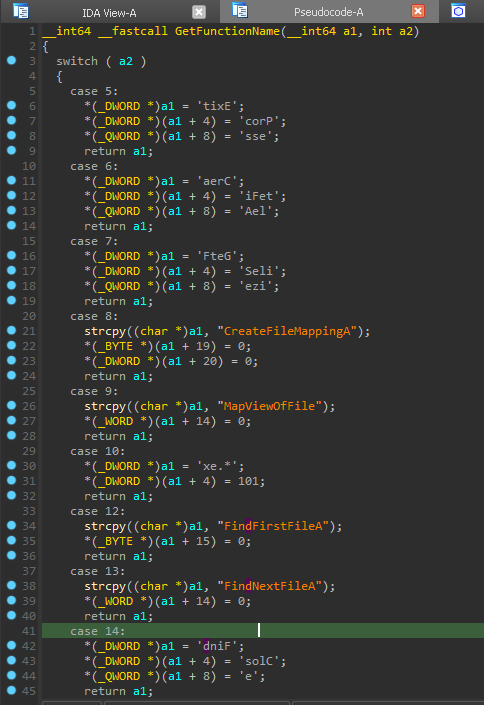
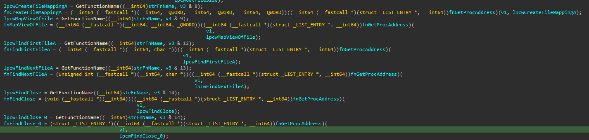
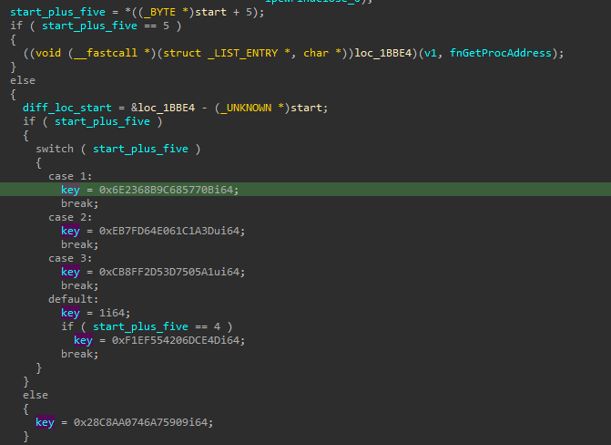
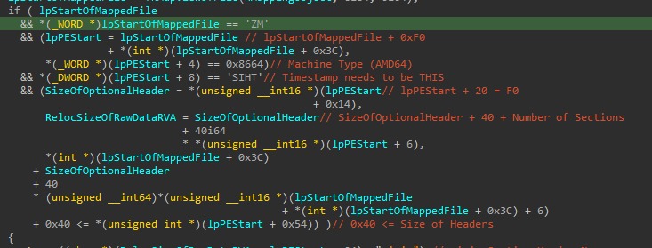
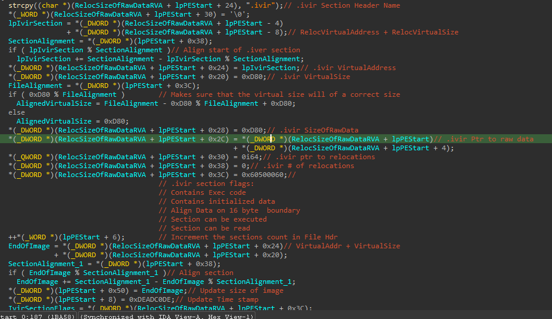
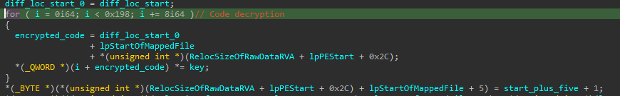
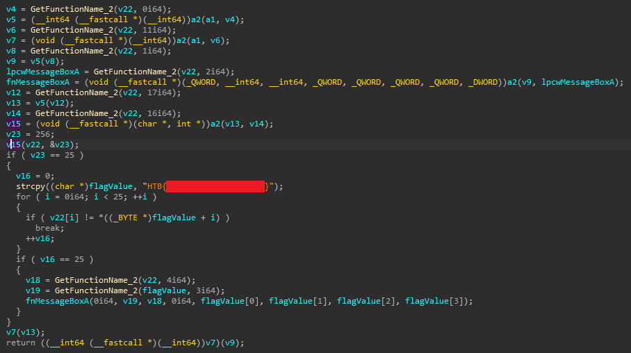

> **Challenge Description**: While cleaning up the workspace of a recently retired employee, we noticed that one of the core files of the very important programs they were working on didn't match up with the backups we have of it, could you check it out for us?

## Initial Analysis

Upon running the executable, nothing out of the ordinary seemed to happen.
The `.exe` printed "Hello World!" and exited normally.
`PEBear` showed that there was another strange section in the exe file called `.ivir`.
I made the assumption that this was a reference to `I terative VIRus`, and the entry point being in this section further reinforced my theory that this was the "virus" part of the file.
The time stamp was set to `deadc0de` which was also strange, since that translates to a date well into the future.



## Reversing with IDA Free

The first interesting function to look at is one that returns a function name based on a number it is given.
It uses stack strings to prevent analysis tools from detecting the string as a string.
We can right click on the hex values to convert them to characters.
The result name is then passed to another function that seems to return a function pointer.
This made me think that the exe was dynamically resolving functions.



After we sort through each function call and match up the result, we can see the functions that have been resolved:



After these functions have been resolved, there is a value 5 bytes after the entry point that is compared.
If the value is 5, then a function is called.
However, this function seems to be broken, encrypted, or heavily obfuscated since the disassembly doesn't seem valid.
Otherwise, what seems like a key value is chosen and saved.



Then the exe will iterate over all the `*.exe` files in its current directory, confirm some checks, and if everything looks good it will perform some actions on the current `.exe` file.
The main check is that the timestamp of the file needs to be set to `THIS` otherwise the infection of the file will not take place.



Most the proceeding infection process isn't super important, and was in fact pretty tedious to look through and rename.
A new section and section header are added and modified to make sure they adhere to alignment rules, and the rest of the process is just copying over the infection code and making it so it replaces the entry point of the victim file.



The end of the process loops over the data from the broken function from earlier, and multiplies it against the key value selected earlier.
This new modified code is then copied into the victim file.
Then the byte 5 bytes ahead of the entry point is incremented and copied into the victim file.
This means when the newly infected victim exe is run, it will use the second key.
Then the next file to be infected will use the third key, and so on until the 4th iteration when that special byte is set to 5.
At that point the strange function from earlier runs.
This implies that after a certain number of infections the strange function reveals itself.
I verified most of this with dynamic analysis as well, but didn't take any screenshots.
If you want to verify with a debugger, set a breakpoint after the `MapViewOfFile` function and follow it in dump.
From there you can follow along with the exe code as it checks and modifies different parts of the victim file.



I ran the exe in `x64Dbg`, and copied out the encrypted code so I could manually decrypt it.
You could just manipulate the registers to do it all within `x64Dbg` but I ran into exceptions doing that so I opted for the python approach.
Here is the script that decrypts the flag function:

```Python
code = [
0xE25C0FE4937ECD98, 0x46943D7D6211854C, 0x7ED9FD7403244F3B, 0x0954450DD34BC4FB,
 0x34738E7E3DC62246, 0x382DF5BC3CDDD484, 0x138529F69C81C398, 0xE9FCF6D4DD85105E,
 0x5B977D744A5DBD4C, 0xC2D93D4B963E5C85, 0xB3DD747A06D5A985, 0xD454843DE2F28EBF,
 0x0215CEB076580EDC, 0x3F55D6792852AA4D, 0x17AF0A0E48DDD484, 0x547EA605BB8640AD,
 0x243D8A75B199B575, 0x27D1C0EDAE5CB998, 0x6108284AE5787878, 0x7E49F4DF10792485,
 0xACD9F651E2F28EBF, 0xADA04BA5BA8A1444, 0xF77252CAFD2A38C9, 0x388BB9FB9D000000,
 0x8CC468D4A37B0000, 0x891DB54E4E4ABD4C, 0xEFCE883F2C030000, 0x399F79C914778100,
 0xB5B1F45FAD045A5C, 0xB721A6D9B394FF4C, 0xB0DE9DB43DD7A1B3, 0xCC3AF2334A813038,
 0x3DD6D4E506470273, 0x339B093AB6A0F837, 0x3E997481AE05CCA5, 0x689018943160B8AC,
 0xE35AE4EDCF035760, 0x6D46B194A1A37B36, 0x3619E5691F021894, 0x0AFD79C343528DEC,
 0x0F7FEA94A59656C0, 0x8DAE5CB998000000, 0x1770879F9859C398, 0x28B283C42B81C398,
 0x7B7B67D3051D07B1, 0xBFE4C34F82F76B75, 0x1B6CED770BFBA985, 0xB8E5061F67130000,
 0x953D7B885F773041, 0x1C206CC310CA422A, 0x87130CC425BC4A04
]

KEY_1 = 0x6E2368B9C685770B
KEY_2 = 0xEB7FD64E061C1A3D
KEY_3 = 0xCB8FF2D53D7505A1
KEY_4 = 0xF1EF554206DCE4D

def reverse_hex_string(h):
    result = ""
    for i in range(0, len(h), 2):
        result = h[i:i+2] + result
    return result

def print_blob(c):
    result = ""
    for v in c:
        hex_string = f"{v:016X}"
        result += reverse_hex_string(hex_string)
    print(result, end="\n\n")


def decrypt(key):
    for i in range(len(code)):
        code[i] = (code[i] * key) & 0xFFFFFFFFFFFFFFFF

decrypt(KEY_1)
decrypt(KEY_2)
decrypt(KEY_3)
decrypt(KEY_4)
print_blob(code)
```

Attempting to analyze this decrypted code didn't yield any results, so I figured it required the context of the full program to work successfully.
At this point I used `HxD` to patch the virus exe to overwrite the encrypted code with the decrypted one.
Then I opened it in IDA and saw that the decrypted code was also resolving more functions dynamically, although these function's aren't too important as the flag is visible in plaintext at this point.
The functions would open up a message box containing the flag value I think.



## Lessons Learned

I spent much more time on this challenge than I should have.
A lot of time was wasted on reversing the exact infection process and seeing what fields were being changed in the headers of the victim file.
I should have focused on the decryption portion and the code surrounding that instead.
All in all, I think for next time I should focus less on the details and more so on the "bigger picture" of what the application is doing.
