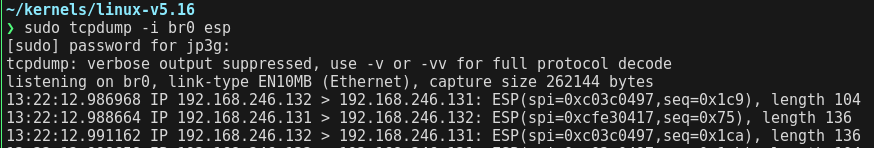
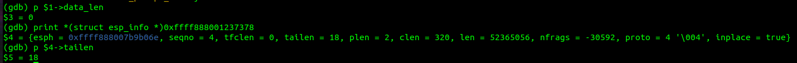
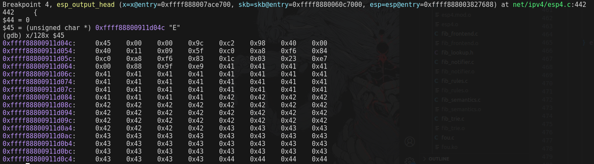
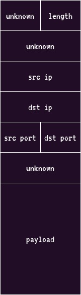
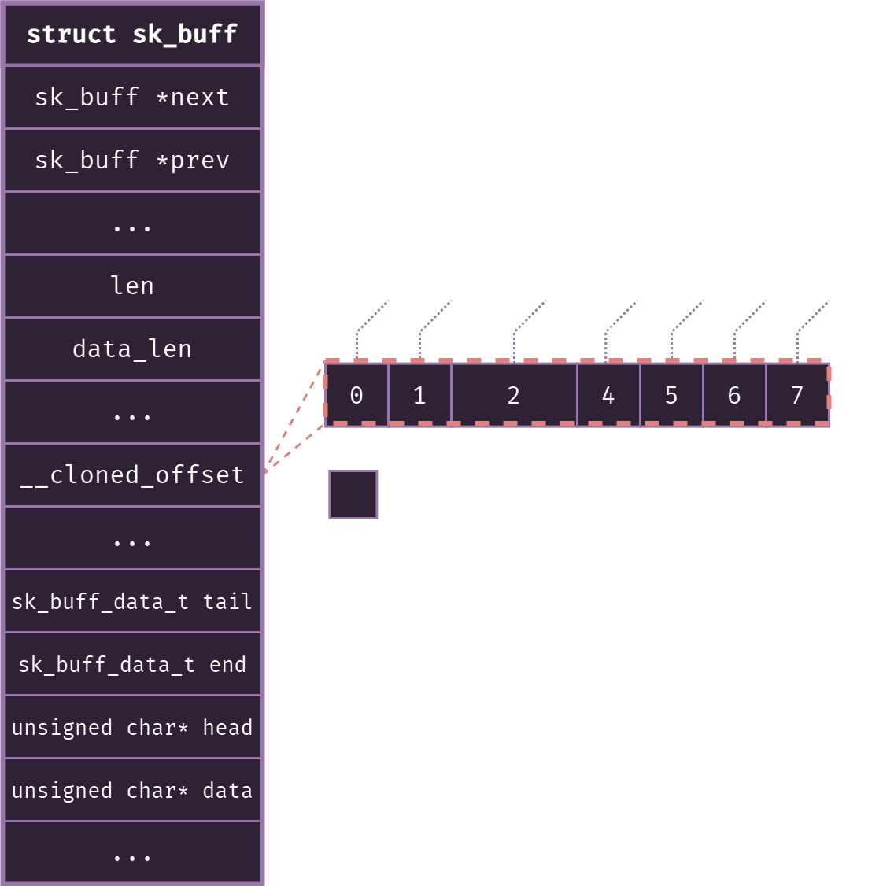
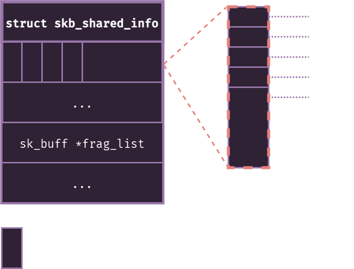

> Disclaimer: This is an active work in progress, things might be wrong, or might not make sense.
> These are pretty much just notes until I finish and clean it up.

## Vulnerability

The vulnerability to exploit today is: [CVE-2022-27666](https://nvd.nist.gov/vuln/detail/CVE-2022-27666).
I just randomly picked this one out from the [Google Recipes Notebook](https://docs.google.com/document/d/1a9uUAISBzw3ur1aLQqKc5JOQLaJYiOP5pe_B4xCT1KA/edit#heading=h.9c6s9d5wfjju).
There a few PoC's for this vulnerability online, which is good because if I get stuck at some point, I can take a look, but the goal is to develop an exploit all on my own.
The advisory says:

> A heap buffer overflow flaw was found in IPsec ESP transformation code in `net/ipv4/esp4.c` and `net/ipv6/esp6.c`.
> This flaw allows a local attacker with a normal user privilege to overwrite kernel heap objects and may cause a local privilege escalation threat.

The vuln appears in the function `int esp_output_head(struct xfrm_state *x, struct sk_buff *skb, struct esp_info *esp)`.
`ESP_SKB_FRAG_MAXSIZE` is defined as `(PAGE_SIZE << SKB_FRAG_PAGE_ORDER)`.

The commit that is linked in the advisory adds a fix to check whether the len of the `skb->data_len + tailen` is greater than `(PAGE_SIZE << SKB_FRAG_PAGE_ORDER)`.

`skb` is a struct representing a socket buffer, and the payload will likely reside in the data buffer within the `skb` struct.
You can find its definition in `/include/linux/skbuff.h`
The next step is to find the references to this vulnerable function, and basically trace my way up to see how to trigger it.
The next reference to it is in `esp_output` within the same file, however `esp_output` doesn't seem to be called anywhere which is a bit strange.
Also, the function is passed to `EXPORT_SYMBOL_GPL`, so it should be accessible from other modules.
This makes it somewhat difficult now, because I still haven't figure out how to trigger the vulnerability.
However, searching for `esp_output` results in finding `/Documentation/crypto/architecture.rst`, which explains how this code is used, which is a big win.
According to google:

> IPsec is a group of protocols for securing connections between devices.
> It is used to provide secure encrypted communication between two computers over an Internet Protocol network.

It basically encrypts IP packets and authenticating the source where the packets come from.
An example would be VPN's.

The IPSEC layer invokes `esp_output` which then triggers the vulnerability, so this actually becomes incredibly simple to trigger once we know how to get the IPSEC layer to invoke the `esp_output`.
This part of IPSEC is the `Encapsulating Security Payload (ESP)` which encrypts the payload.
Based on this we can assume that we don't need to setup anything external for this vulnerability, we just need to prepare an IP packet to be sent out.


## Environment Setup

### QEMU

I recommend you use an Ubuntu VM for this, I had issues developing on Kali.
We can start by setting up github.
After you download the linux repo, switch to the vulnerable version / tag with:

```
git checkout -b CVE-2022-2766 v5.16
```
This will create a branch named `CVE-2022-2766` which will contain all the content within the `v5.16` commit, which is the last vulnerable version.

We can then more or less follow the instructions [given here by kernw0lf](https://kernw0lf.github.io/posts/qemu_debug/).
Create a default config file with `make defconfig`.
Then we add a few more extra settings to help with debugging:

```
CONFIG_KCOV=y
CONFIG_DEBUG_INFO=y
CONFIG_KASAN=y
CONFIG_KASAN_INLINE=y
CONFIG_CONFIGFS_FS=y
CONFIG_SECURITYFS=y
```

Additionally, there are a few other options you have to enable, but for brevity you can access the correct config file at my repo [here](https://github.com/).

Then compile with `make -j$(nproc)`.
Next you have to download the ubuntu cloud iso.
I tried getting this to work with busybox, as I wanted a barebones system so I can focus on just this vulnerability, but after several days of struggling I gave in and opted for this method you'll see below.
First, download a recent minimal Ubuntu cloud image from [here](https://cloud-images.ubuntu.com/minimal/releases/): 

Then you need to configure the users, set up ssh keys, etc:

```bash
sudo apt-get install libguestfs-tools

virt-customize -a /path/to/ubuntu.img \
    --run-command 'apt-get update' \
    --install ssh-server \
    --install strongswan \
    --install vim \
    --run-command 'systemctl enable ssh' \
    --root-password password:root \
    --ssh-inject root:file:/path/to/root/ssh.pub \
    --run-command 'useradd -m -s /bin/bash pwn' \
    --password pwn:password:abc123 \
    --ssh-inject pwn:file:/path/to/pwn/ssh.pub \
    --copy-in /lib/modules/5.16.0:/lib/modules/
```

Then we can run the image like:

```bash
#!/bin/bash

qemu-system-x86_64 \
	-m 2G \
	-smp 2 \
	-kernel ./bzImage \
	-drive file=./ubuntu-20.10-minimal-cloudimg-amd64.img \
	-append "root=/dev/sda1 rw console=ttyS0" \
	-nographic \
	-netdev user,id=net0,hostfwd=tcp::2222-:22 \
	-device virtio-net,netdev=net0
```

After logging in, verify that `strongswan` is running with:

```bash
systemctl status strongswan-starter
```

### Networking

We also need set up IPSec's config on the guest to ensure we are creating IPSEC packets.
For this purpose I'll create a "non-working" configuration, but it should be enough for our exploit.
Add the following files:

```
# Added to /etc/ipsec.conf

conn local-to-fake
    left=<qemu ip>
    right=<host ip>
    leftsubnet=<qemu subnet>
    rightsubnet=<host subnet>
    authby=secret
    auto=start
```

```
# Added to /etc/ipsec.secrets

<qemu ip> <host ip> : PSK "secret"
```
Theres a bit more setup still, but basically you have to create a bridged network between qemu and your host, and then assign your qemu instance an IP.
I will come back later and update this section with the correct config.

You can test whether the IPSEC packets are sending with tcpdump:



### GDB I

Now you can debug the `esp4` module by adding `-s -S` to the qemu command.
Get the load address of the module:

```bash
cat /proc/modules
```

then set up gdb:

```
gdb ./vmlinux
(gdb) target remote localhost:1234
(gdb) add-symbol-file /lib/modules/5.16.0/kernel/net/ipv4/esp4.ko <load address>
(gdb) b esp_output_head
```

### GDB II

Once you verify that your IPSEC tunnel is up and running, then continuing in GDB should hit your breakpoint relatively quickly.


We can view the value of our argument of interest with:

```
(gdb) print *(struct sk_buff *)<address of sk_buff>
```

Now it should be saved in `$1`.
So you can access `data_len`, `len` and `tail_len` the same way you would in c:

```
(gdb) p $1->data_len
(gdb) p $1->len
(gdb) p $1->tailen
```

There is an important distinction to mention here before `data_len` and `len`.
`Len` is the total size of our buffer.
`data_len` is the paged size of our packet.
In other words, if our payload is large enough, then we will require it to store in big blocks of memory called "pages".
If it is small enough to store within contiguous memory, then `data_len` will be 0 because we don't need to allocate large chunks of memory for it.




I wrote the following program in rust to send a big packet that we can then use to debug and follow the flow in gdb:

```rust
use std::net::UdpSocket;

fn main() -> std::io::Result<()> {
    let address = "192.168.246.131:9191";

    let payload = format!(
        "{}{}{}{}",
        "A".repeat(32),
        "B".repeat(32),
        "C".repeat(32),
        "D".repeat(32)
        );

    let socket = UdpSocket::bind("0.0.0.0:7171")?;

    socket.send_to(payload.as_bytes(), address)?;

    println!("[+] Sent payload");

    Ok(())
}
```

We don't need to receive the packet, we just need to send it over the IPSEC tunnel, and it doesn't matter after that.

But write this, have it run continuosly in the background, and eventually you can catch in GDB:



In this case you can see that `data_len` is 0.
This is because our payload is very small.
So it doesn't require the kernel to allocate pages to accomodate the data.
Instead if we look at `len` we will see that the data is of length `156`.

I do not know how all the 28 header bytes here are formatted, but if I figure it out, I will come back and update this section.



## Vuln Flow

Just creating a massive packet isn't enough to trigger the vulnerability, at least not in my testing.
There are a few checks that must be passed.

A page is `0x1000` bytes, or `4096` in decimal.
Another thing to keep in mind, the patch defines the max size as `(PAGE_SIZE << SKB_FRAG_PAGE_ORDER)`, and from the source code we can figure out that `SKB_FRAG_PAGE_ORDER` is `15`.
So the max size here is:

```
(4096 << 15) = 0x8000000 bytes
```

We also have to account for the `28` bytes of header probably.
Anyways, tracking the `allocsize` variable in `esp_output_head`, we see that it gets used in `skb_page_frag_refill`.
We can ignore the `unlikely()` that wraps it, this is just an optimization.

`skb_page_frag_refill` is defined in `/net/core/sock.c`:

```c
bool skb_page_frag_refill(unsigned int sz, struct page_frag *pfrag, gfp_t gfp)
{
	if (pfrag->page) {
		if (page_ref_count(pfrag->page) == 1) {
			pfrag->offset = 0;
			return true;
		}
		if (pfrag->offset + sz <= pfrag->size)
			return true;
		put_page(pfrag->page);
	}

	pfrag->offset = 0;
	if (SKB_FRAG_PAGE_ORDER &&
	    !static_branch_unlikely(&net_high_order_alloc_disable_key)) {
		/* Avoid direct reclaim but allow kswapd to wake */
		pfrag->page = alloc_pages((gfp & ~__GFP_DIRECT_RECLAIM) |
					  __GFP_COMP | __GFP_NOWARN |
					  __GFP_NORETRY,
					  SKB_FRAG_PAGE_ORDER);
		if (likely(pfrag->page)) {
			pfrag->size = PAGE_SIZE << SKB_FRAG_PAGE_ORDER;
			return true;
		}
	}
	pfrag->page = alloc_page(gfp);
	if (likely(pfrag->page)) {
		pfrag->size = PAGE_SIZE;
		return true;
	}
	return false;
}
```

Here is where things start to get interesting.
Notice the calls to `alloc_pages()`.
This [function takes 2 values](https://www.kernel.org/doc/gorman/html/understand/understand023.html), a mask, and an order.
The order determines the size of the allocation.
The number of pages to be allocated will be `2 ^ order`.
I determined previously that `SKB_FRAG_PAGE_ORDER` was 15, so at max, the first potential call to `alloc_pages` will allocate enough pages to accomodate
32768 bytes, which is 8 pages.
Then, the size is set to `0x8000000` within the pointer to the `page_frag` that `esp_output_head` passed in.
So to summarize, now `&x->xfrag->size` is `0x0x8000000`, and `&x->xfrag->page` points to the 8 pages that were allocated to us.
However, I still haven't found the actual operation that writes to this buffer.


### struct esp_info


### struct xfrm_state

This structure holds information about the IPSEC state, but more importantly it holds the buffer that our packet data will be written into.
You can find more information in `/include/net/xfrm.h`.

Around this point is where I ran into an issue.
Even though I had a big payload, I was unable to enter the code that created the default size allocation.

```c
if (!skb_cloned(skb)) {
...
```



The buffer cannot be generated with `skb_cloned()` and is not one of multiple shared copies of the buffer.
Cloned buffers are shared data so must not be written to under normal circumstances.
Achieved by:
TODO:

```c
if (tailen <= skb_tailroom(skb)) {
	...
```

`skb_tailroom` will return 0 if the data is paginated, when happens for big payloads.
Since we need our payload to be big and paginated, then we must ensure that `esp->tailen` is NOT 0, otherwise entering this branch will not allocate the buffer we need.
Achieved by:
TODO:

```c
} else if ((skb_shinfo(skb)->nr_frag) < MAX_SKB_FRAGS)
    && !(skb_has_frag_list) {
		...
```

We want this to evaluate to true.



`skb_shinfo` will return the `skb` endpointer, which could be `skb->head + skb->end` or `skb->end`.
Eitherway, it will be of type `skb_shared_info`, and we need the `nr_frag` value to be less than `MAX_SKB_FRAGS = #define MAX_SKB_FRAGS (65536/PAGE_SIZE + 1)` (from `/include/linux/skbuff.h`).
The actual value will be `65536 / 0x1000 + 1 = 17`.
So we do have a max size for our payload, since we don't want it to be split into 17 fragments.
Additionally, this structure cannot have a frag list, which means that it must not be fragmented at all.
Achieved by:
TODO:

