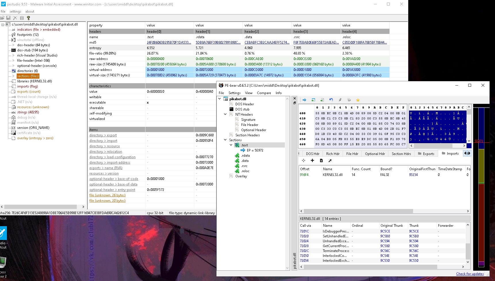
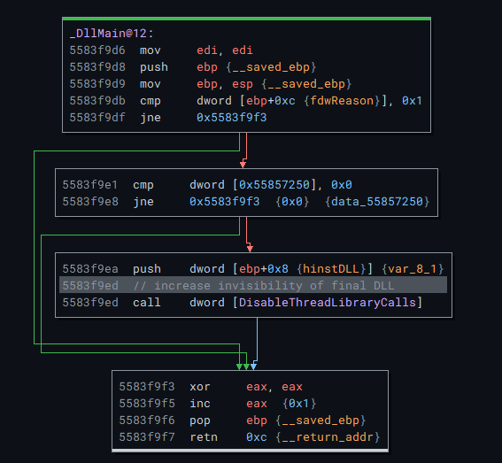
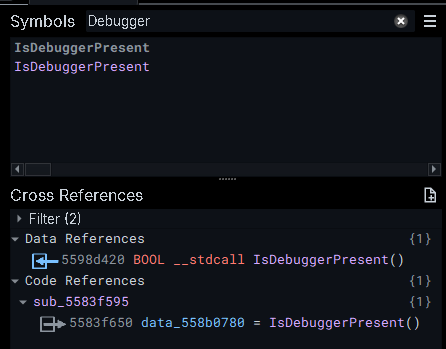
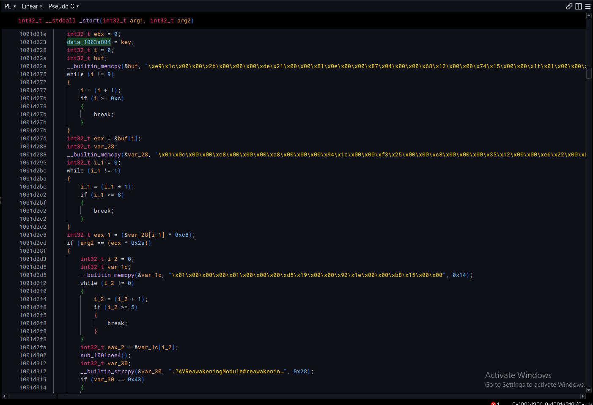

## Sample Info

[7e26c4f6f313e5248898a1dbe706ae5b998e12ff16947cb3bfda690ca62612c4](https://bazaar.abuse.ch/sample/7e26c4f6f313e5248898a1dbe706ae5b998e12ff16947cb3bfda690ca62612c4/)

## Initial Analysis

Based on low number of imports, plus a large and high entropy `.rsrc` section, this sample is likely packed.

Among the imports are `IsDebuggerPresent` and `GetTickCount` which could be signs of anti-vm techniques that are present in this sample as well.
There were also a large number of exports, all named after some drawing related functionality.

## Loader
In the DLLMain that binja finds, there is a call to `DisableThreadLibraryCalls` which is a tactic that increases the invisibility of the DLL.
It will disable the `DLL_THREAD_ATTACH` and `DLL_THREAD_DETACH` notifications.

However, there isn't much more to see within this main function.
Due to the massive amount of exports, and not having access to the delivery method part of the sample, figuring out the function responsible for unpacking is going to be difficult.
However, Pikabot is known to use a lot of anti analysis, so a good place to start would be to look for usage of `IsDebuggerPresent`, since the locations in where it appears are likely part of the unpacking process.
And fortunately, it only appears once, making this idea a success.
This gives me a starting point from where I can start unraveling this sample.

Unfortunately, following up the call history still results in a lot of options for arriving to this check, so I decide to use process of elimination to start getting rid of some of the exported functions.

** WORK IN PROGRESS **

## Payload

I jumped ahead with `unpac.me` to unpack the sample and start looking at the main payload.
Right away, we can see that there is some multiplication of values (maybe a potential key), and data is being copied into some buffers.
There are also references to chrome extensions in some of the strings in this `_start` function.

There does seem to be some level of obfuscation when determining the indices of the arrays by using while loops with 2 conditions, one of them being impossible.
