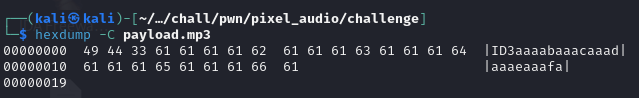
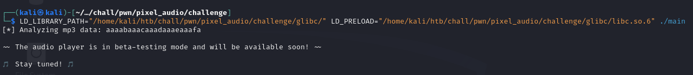
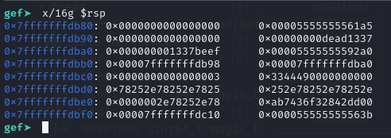
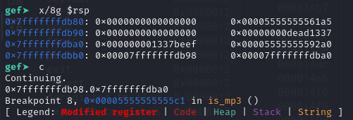

## Locating Vulnerability

The challenge consists of a web server that allows a user to upload an mp3 file, and then plays that file.


Next, it is time to reverse engineer the application in binary ninja.
The code is pretty straightforward, there is a check to see if the uploaded file is an mp3.

 

In the mp3 check, there seems to be some "beta" functionality, which is where the code to reveal the flag is.


We need to change two of the variables to different values in order to trigger the beta function.
There are 2 `freads` that occur in this function.
Both read from the mp3 file we upload.
The first one is a read of 3 bytes, which is meant to obtain the magic bytes of the file.
The magic bytes need to be the string `ID3`.

The second read is of size `0x16` bytes, and is interesting because the read bytes are later printed via a `printf` statement.
This makes me think that we could do a write via a format string vulnerability.
At this point, I don't know if there is an overflow in any of the `fread` calls, but we know that there is a pointer to the two values we need to change, which we can catch with a format string exploit, and then we can write a specific value to those addresses using a format string payload.
The next step is to verify these vulnerabilities with a debugger.

## Verifying vulnerability

I built a PoC payload using the correct magic bytes, and used a cyclic pattern of `0x16` bytes incase there is an overflow.



Since we have a specific libc to use, we have to use the following command to run the binary:

```bash
LD_LIBRARY_PATH=/path/to/glibc LD_PRELOAD=/path/to/glibc/libc.so.6 ./main
```
Additionally the file is being called as `/tmp/test.mp3` so we need to change the name and location of our PoC.

Behaviour is as expected, no obvious overflow since stack cookie fail was not triggered.



Checking out a generic format string payload in GDB, I was also able to verify that there was no overflow.



The payload starts at `0x7fffffffdbd0`, and isn't enough to overwrite not even the stack cookie, which is at `0x7fffffffdbe8`
So at this point I am confident that this is just a format string vuln.
I am able to get the pointers to the values that need to change by referencing the 12th and 13th values on the stack: `%12$p.%13$p`



## Exploit

Since we now know where to write, we can craft our write.
The first write will be for 48879, and the second for 49374.
