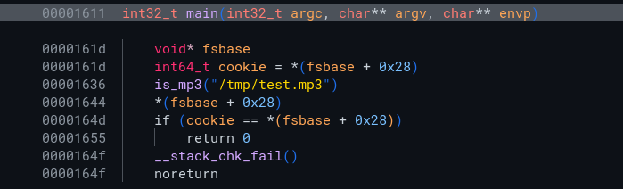
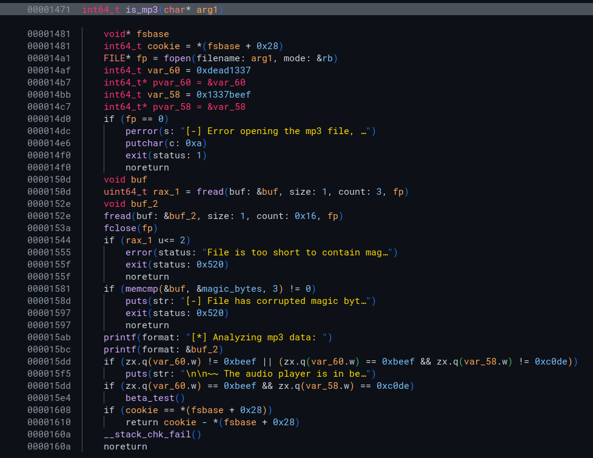
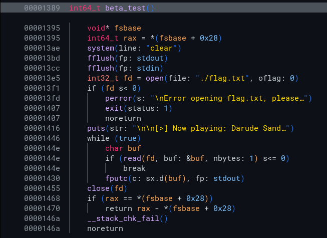

## Locating Vulnerability

The challenge consists of a web server that allows a user to upload an mp3 file, and then plays that file.

Next, it is time to reverse engineer the application in binary ninja.
The code is pretty straightforward, there is a check to see if the uploaded file is an mp3.

 

In the mp3 check, there seems to be some "beta" functionality, which is where the code to reveal the flag is.

We need to change two of the variables to different values in order to trigger the beta function.
There are 2 `freads` that occur in this function.
Both read from the mp3 file we upload.
The first one is a read of 3 bytes, which is meant to obtain the magic bytes of the file.
The magic bytes need to be the string `ID3`.

The second read is of size `0x16` bytes, and is interesting because the read bytes are later printed via a `printf` statement.
This makes me think that we could do a write via a format string vulnerability.
At this point, I don't know if there is an overflow in any of the `fread` calls, but we know that there is a pointer to the two values we need to change, which we can catch with a format string exploit, and then we can write a specific value to those addresses using a format string payload.
The next step is to verify these vulnerabilities with a debugger.