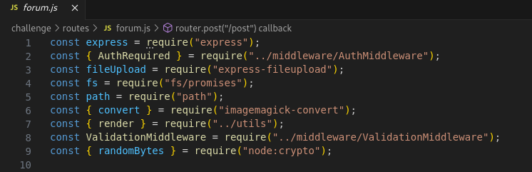
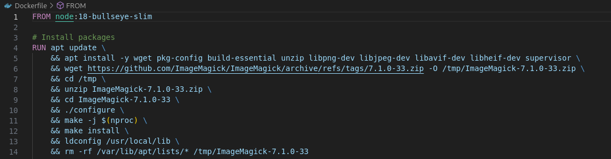
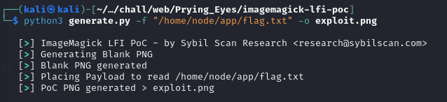
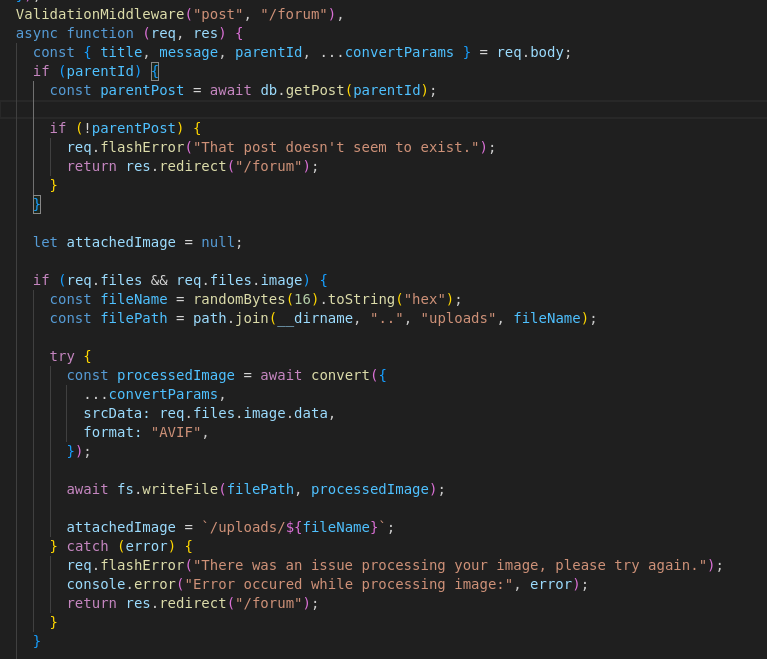
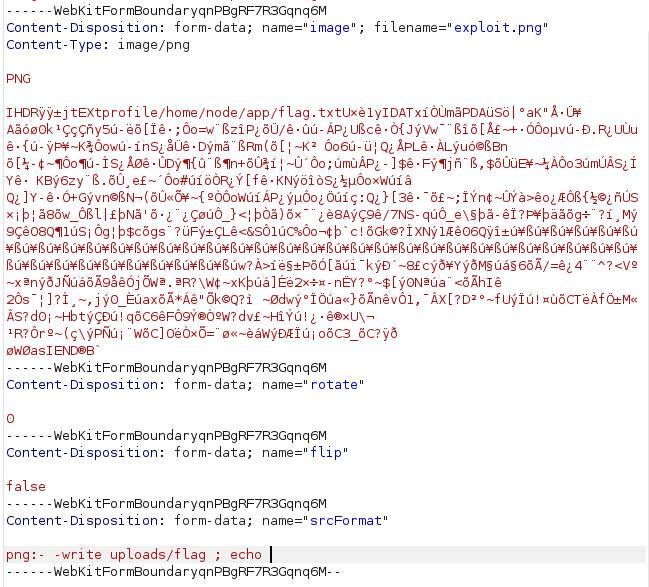

> **Challenge Description**: Welcome to the Prying Eyes, a "safe space" for those curious about the large organisations that dominate our life.
> How safe is the site really?

## Walkthrough

The challenge involves what seems to be a leaks forum / marketplace, very reminiscent of RaidForums (RIP).


Other than some interesting posts, doesn't seem to be much else so I moved on to source code review at this point.
Right away, I noticed that one of the pages was using `Imagemagick` which is known to have tons of vulnerabilities.



`Imagemagick-convert` is just a JavaScript interface for the `convert` CLI tool from `Imagemagick`, which according to the Dockerfile from the challenge is version `7.1.0-33`.



A little googling brings us to this [exploit](https://github.com/Sybil-Scan/imagemagick-lfi-poc).
Generating the exploit is pretty straightforward, just follow the instructions from the script.



Now its important to note that the file read is only accessible if the output file of the `convert` operation is a `png`.
I got stuck on this for quite a while, but looking at the source code for the forum revealed another vulnerability.



The fact that we can pass in our own arguments through intercepting the post request implies there is an argument that we can use that will allow us to change the output file format.
The source code for the convert function can be found here

- [imagemagick-convert](https://www.npmjs.com/package/imagemagick-convert?activeTab=code)

The code pretty much just creates a command string that is then passed to a command process.
The data from the uploaded image is passed through standard input, and our options are concatenated together.
The intended command string is supposed to look like this:

```bash
convert <args> - AVIF:file_name 

```

However, since it just concats whatever is passed to it without much processing, it allows for command injection.
The output file name is the last arg to be concated to the string, so we just need an option that occurs before it.

```js
 /**
     * Create occurrence
     * @param {string|null} format
     * @param {string|null} name
     * @returns {string}
     */
    createOccurrence(format = null, name = null) {
        const occurrence = [];

        if (format) occurrence.push(format);
        occurrence.push(name || '-');

        return occurrence.join(':');
    }

```

For this purpose the `srcFormat` option will work, especially because it is the argument that is inserted right before the output file name.
At this point I realized that I probably don't have to use the built in vulnerability in the `Imagemagick` module, and could probably just use the command injection I have here to spawn a shell or use `mv` to copy the flag to the output directory, but the `convert` tool has a `-write` option that just simplifies everything so that is the reason I ended up not using a more sophisticated command injection payload. 
Anyways, we will insert the following into the `srcFormat` parameter:

```bash
png:- -write uploads/flag ; echo
```
The space after `flag` and the `; echo ` are important in order to break up the original command and prevent any errors from breaking our injection.
The final command thats runs server side would be:

```bash
convert <args> png:- -write uploads/flag ; echo AVIF:file_name
```



Then we can download the flag, and use `exiftool -b` to extract the flag from the image :).