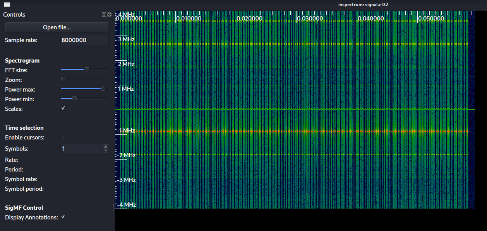
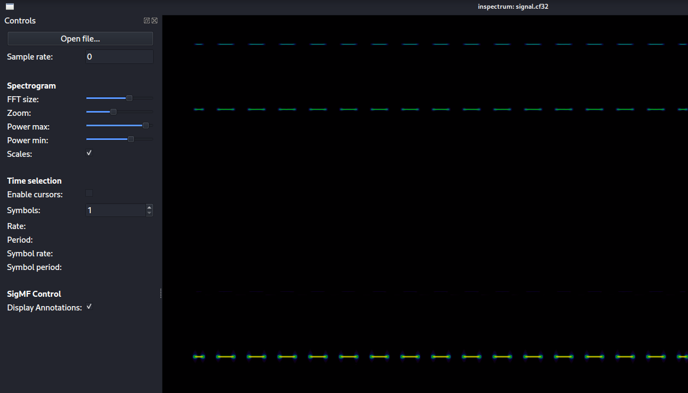
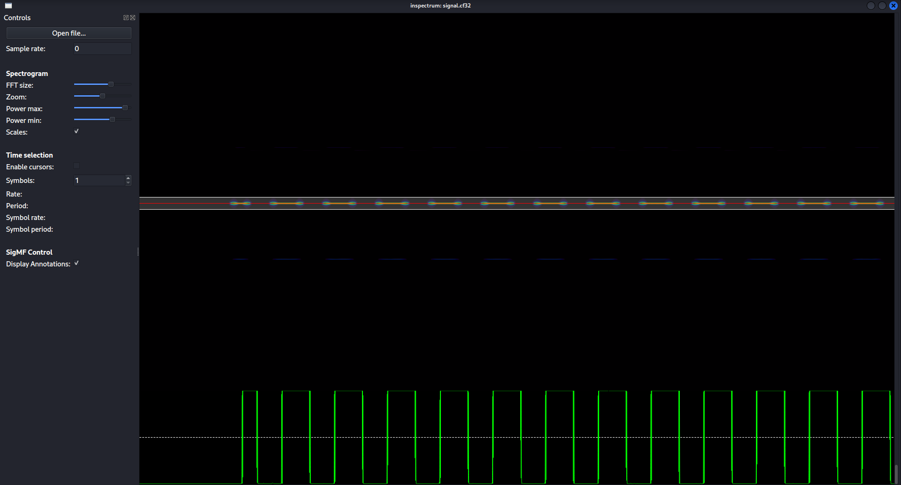
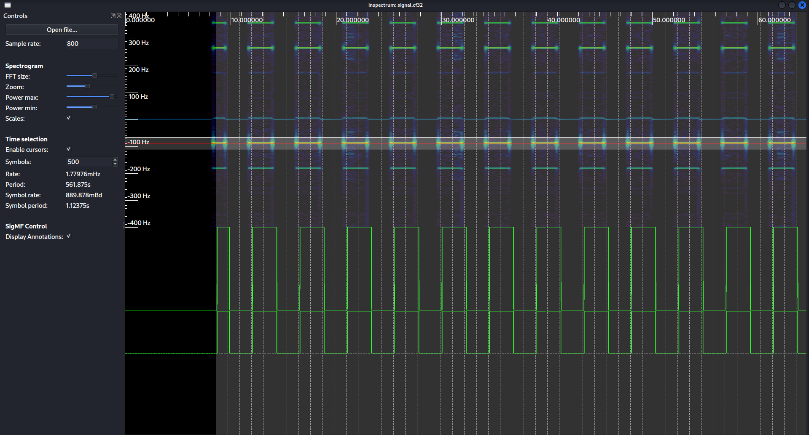
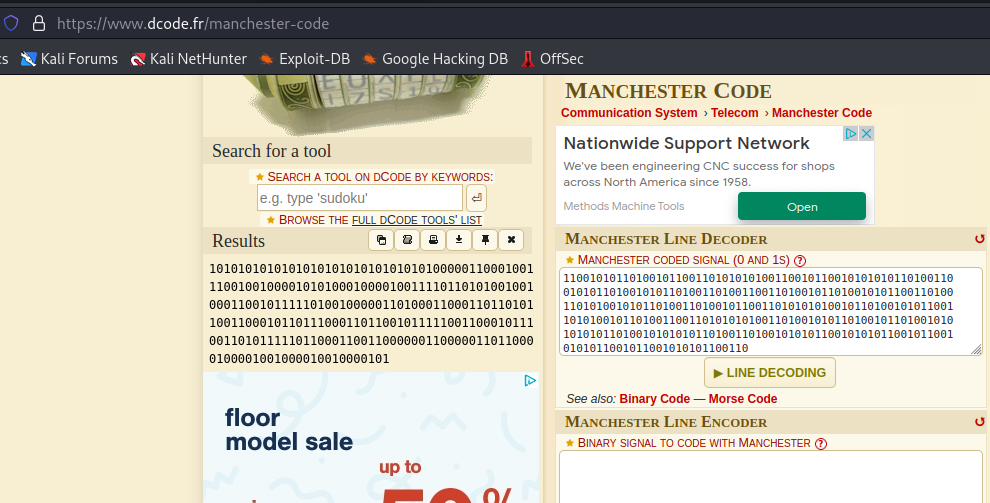
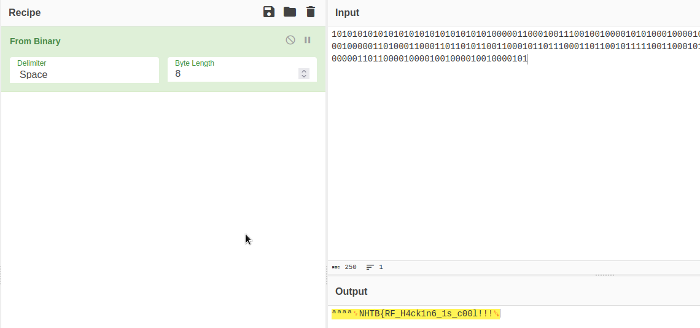

> **Challenge Description**: We have found the garage where some cyber criminals have all their stuff.
> Using an SDR device, we captured the signal from the remote key that opens the garage.
> Can you help us to analyze it?

## Walkthrough

The challenge zip file contains `signal.cf32` which can be opened with inspectrum.

We can increase the FFT size, power max, and power min settings to get a more clear view of the signals.

Then we can right click on the bright signal segments and add an amplitude plot.
We need to shrink our window to reduce noise.

Now we right click on our amplitude plot, and select `Add derived plot -> add threshold plot` to get our plot of 1's and 0's.
We also enable the cursors so we can start describing what will determine a 1 and what will determine a 0.
Then we can increase the amount of cursors until we have covered the entire capture.
Doesn't need to be perfectly lined up.

To export the bits, we need to right click on the threshold plot, and then select extract symbols to stdout.
I removed the whitespace and comma's so that I could use it with an online machenster decoding tool.
You can figure out this is manchester encoded due to the bit patterns.
The bits are always going from high to low, or low to high, but never high to high or low to low.
You can use [dcode.fr/manchester-code](https://dcode.fr/manchester-code) to decode the bits into their final form.

After we have the final decoded bits, we can use CyberChef to convert the bits to text.

