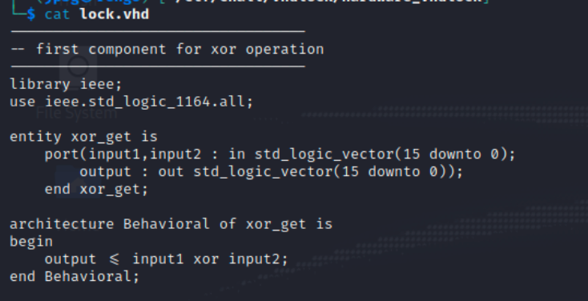
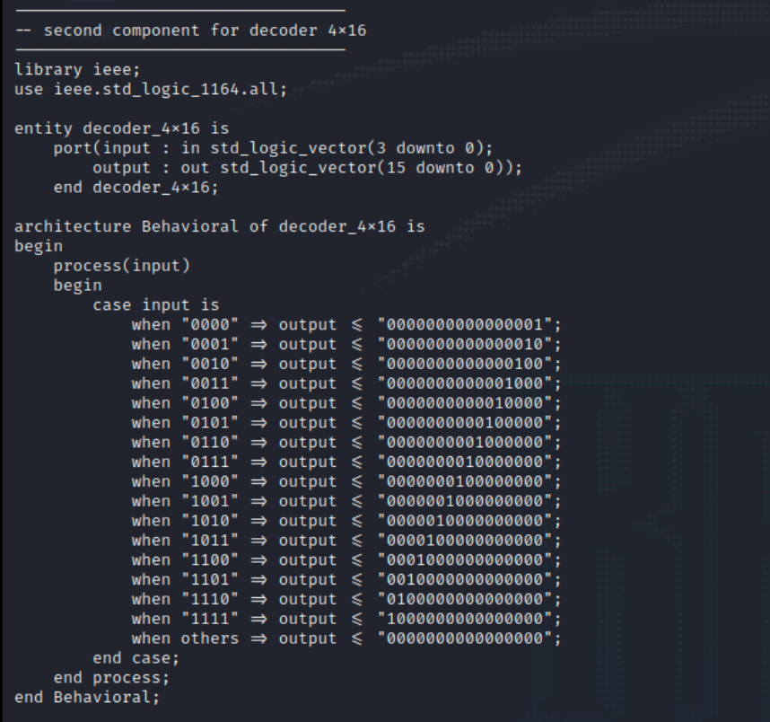

> **Challenge Description**: We found ourselves locked in an escape room, with the clock ticking down and only one puzzle to solve.
> The final challenge involves opening the door, and the clue provided to use by the game master is that the key for the encrypted password is a 4-byte sequence.

## Walkthrough

The challenge download gives us two files `lock.vhd` and `out.txt`.
The second file is presumably the output of the first, and contains two columns of values.
At first glance the first file appears to be a Virtual Hard Disk, but based on the name of the challenge and a quick search of the import `use ieee.std_logic_1164.all`, it can be determined that this is a VHDL file.
If you want to learn more about VHDL files, and how to write/read them, I recommend this playlist:
[Your first VHDL Program](https://www.youtube.com/watch?v=h4ZXge1BE80).

The first part of this file is creating an `xor_get` function that takes 2 inputs, each 2 bytes wide, XOR's them, and outputs the 2 byte result to `output`.



The second component takes in a 4 but value and maps it to a 16 bit value. This value is given to `output`.



The last component of the file is where the process of generating `out.txt` can be explained.


The `main` entity describes the inputs we can expect.
2 4-bit values, along with a 2 byte XOR key, and it will have 2 2-byte outputs, seen in `out.txt`.
Our 2 4-bit values are translated into a 16-bit value, and then those values are XOR'd against the unknown key.
However, given that HackTheBox flags always have the format `HTB{...}` we can assume to know the first 4 inputs.
Since we now know the 2 of the 3 values used in the XOR operation used to generate the outputs, we can derive the 4 byte key using the following process:

```
output_1 ^ decoder_4x16("H") = 1st byte of key.
output_2 ^ decoder_4x16("T") = 2nd byte of key.
output_3 ^ decoder_4x16("B") = 3rd byte of key.
output_4 ^ decoder_4x16("{") = 4th byte of key.
```
Here is the code to generate the key:

```Python
#!/usr/bin/python3

def decoder_4x16(signal):
    cases = dict()
    val = 1
    for n in range(16):
        cases[n] = val
        val = val << 1
    if (signal < 0) or (signal > 15):
        return 0
    else:
        return cases[signal]

def get_key():
    inputs = []
    outputs = [35, 307, 17, 33, 33, 53, 183, 2103]
    key = []

    for c in "HTB{":
        inputs.append( (ord(c) & 0xf0) >> 4 )
        inputs.append( ord(c) & 0x0f )

    for i in range(len(inputs)):
        key.append( decoder_4x16(inputs[i]) ^ outputs[i] )

    for k in key:
        print(f"0x{k:02X}")

get_key()
```
It will output the values:

```
0x33
0x33
0x31
0x31
0x31
0x31
0x37
0x37
```

From this we know the key to be `0x33313137`.
Now the rest of the challenge is just to reverse the outputs so we can figure out the inputs.
Here is the code to solve the challenge:

```Python
#!/usr/bin/python3

def encoder_4x16(signal):
    cases = dict()
    val = 1
    for n in range(16):
        cases[val] = n
        val = val << 1
    return cases[signal]

def reverse_process():
    key = [ 0x33, 0x31, 0x31, 0x37 ]
    lines = None
    outputs = []
    flag = ""
    with open("out.txt") as f:
        lines = f.readlines()
    for line in lines:
        outputs.append([int(x) for x in line.strip().split(" ")])

    for i in range( len(outputs) ):
        d1 = encoder_4x16( outputs[i][0] ^ (key[i % 4] ))
        d2 = encoder_4x16( outputs[i][1] ^ (key[i % 4] ))

        c = (d1 << 4) | d2
        flag += chr(c)
    print(flag)

reverse_process()
```

The flag is: `HTB{I_L0v3_VHDL_but_LOve_my_5w33thear7_m0re}`.